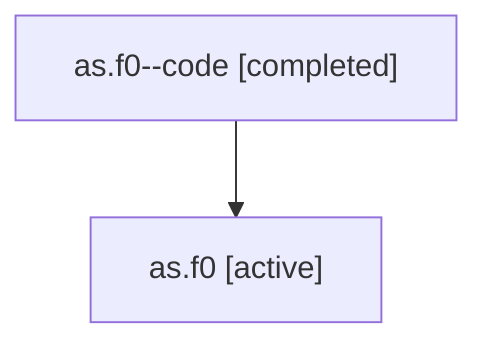

# Family: as.f0

[Agent Hoods](../README.md) / [bbugyi200](../users/bbugyi200/README.md) / [athena](../users/bbugyi200/machines/athena/README.md) / [as](../users/bbugyi200/machines/athena/hoods/as/README.md) / as.f0

Owner: `bbugyi200.athena` · Hood: `as` · Members: 2

## Lineage

The diagram is an optional enhancement; the ordered table below contains the same lineage in accessible text.

| Role | Agent | State | Model / provider | Timing | Commits | Prompt | Chat |
|---|---|---|---|---|---:|---|---|
| code | as.f0--code | completed | gpt-5.6-sol / codex | 2026-07-16T20:39:17.510232+00:00 | 0 | — | [Chat](../agents/bbugyi200.athena.as.f0--code/chat.md) |
| root | as.f0 | active | gpt-5.6-sol / codex | 2026-07-16T20:31:51.472807+00:00 | [1](../agents/bbugyi200.athena.as.f0/README.md#commits) | [Prompt](../agents/bbugyi200.athena.as.f0/prompt.md) | [Chat](../agents/bbugyi200.athena.as.f0/chat.md) |

## Commits

| Role | Commit | Subject | Committed (UTC) |
|---|---|---|---|
| root | [`9624746`](https://github.com/sase-org/sase/commit/9624746a4948f0935eebe8778c89cb33ea6a660f) | feat(ace): auto-expand panels for agent jumps | 2026-07-16 21:01:00 |

## Neighbors

| Agent | Relation | State |
|---|---|---|
| [as](bbugyi200.athena.as.md) (family · 2) | ancestor | active 1, completed 1 |
