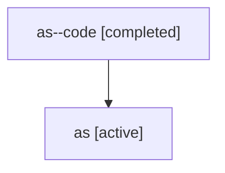

# Family: as

[Agent Hoods](../README.md) / [bbugyi200](../users/bbugyi200/README.md) / [athena](../users/bbugyi200/machines/athena/README.md) / [as](../users/bbugyi200/machines/athena/hoods/as/README.md) / as

Owner: `bbugyi200.athena` · Hood: `as` · Members: 2

## Lineage

The diagram is an optional enhancement; the ordered table below contains the same lineage in accessible text.

| Role | Agent | State | Model / provider | Timing | Commits | Prompt | Chat |
|---|---|---|---|---|---:|---|---|
| code | as--code | completed | gpt-5.6-sol / codex | 2026-07-16T20:06:59.258270+00:00 | [1](../agents/bbugyi200.athena.as--code/README.md#commits) | — | [Chat](../agents/bbugyi200.athena.as--code/chat.md) |
| root | as | active | gpt-5.6-sol / codex | 2026-07-16T20:00:33.200410+00:00 | [1](../agents/bbugyi200.athena.as/README.md#commits) | [Prompt](../agents/bbugyi200.athena.as/prompt.md) | [Chat](../agents/bbugyi200.athena.as/chat.md) |

## Commits

| Role | Repo | Commit | Subject | Committed |
|---|---|---|---|---|
| code | sase | [`494d5c5`](https://github.com/sase-org/sase/commit/494d5c5632822b3efd5b3c913907915949d59a59) | feat(ace): add jump hints for collapsed agent panels | 2026-07-16 16:31:15 EDT |
| root | sase | [`494d5c5`](https://github.com/sase-org/sase/commit/494d5c5632822b3efd5b3c913907915949d59a59) | feat(ace): add jump hints for collapsed agent panels | 2026-07-16 16:31:15 EDT |

## Neighbors

| Agent | Relation | State |
|---|---|---|
| [as.f0](bbugyi200.athena.as.f0.md) (family · 2) | descendant | active 1, completed 1 |
