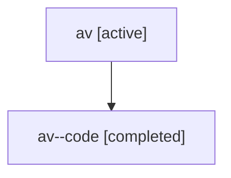

# Family: av

Owner: `bbugyi200.athena` · Hood: `av` · Members: 2

## Lineage

The diagram is an optional enhancement; the ordered table below contains the same lineage in accessible text.

| Role | Agent | State | Model / provider | Timing | Commits | Prompt | Chat |
|---|---|---|---|---|---:|---|---|
| root | av | active | gpt-5.6-sol / codex | 2026-07-16T20:12:39.493052+00:00 | 1 | [Prompt](../agents/bbugyi200.athena.av/prompt.md) | [Chat](../agents/bbugyi200.athena.av/chat.md) |
| code | av--code | completed | gpt-5.6-sol / codex | 2026-07-16T20:17:18.244652+00:00 | 1 | — | [Chat](../agents/bbugyi200.athena.av--code/chat.md) |
