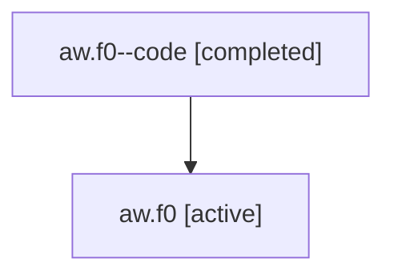

# Family: aw.f0

Owner: `bbugyi200.athena` · Hood: `aw` · Members: 2

## Lineage

The diagram is an optional enhancement; the ordered table below contains the same lineage in accessible text.

| Role | Agent | State | Model / provider | Timing | Commits | Prompt | Chat |
|---|---|---|---|---|---:|---|---|
| code | aw.f0--code | completed | gpt-5.6-sol / codex | 2026-07-16T21:13:04.654719+00:00 | 0 | — | [Chat](../agents/bbugyi200.athena.aw.f0--code/chat.md) |
| root | aw.f0 | active | opus / claude | 2026-07-16T21:03:10.369847+00:00 | 1 | [Prompt](../agents/bbugyi200.athena.aw.f0/prompt.md) | [Chat](../agents/bbugyi200.athena.aw.f0/chat.md) |
