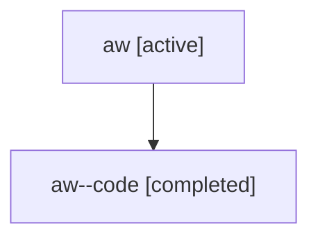

# Family: aw

Owner: `bbugyi200.athena` · Hood: `aw` · Members: 2

## Lineage

The diagram is an optional enhancement; the ordered table below contains the same lineage in accessible text.

| Role | Agent | State | Model / provider | Timing | Commits | Prompt | Chat |
|---|---|---|---|---|---:|---|---|
| root | aw | active | claude-fable-5 / claude | 2026-07-16T20:26:45.509056+00:00 | 1 | [Prompt](../agents/bbugyi200.athena.aw/prompt.md) | [Chat](../agents/bbugyi200.athena.aw/chat.md) |
| code | aw--code | completed | gpt-5.6-sol / codex | 2026-07-16T20:38:39.625886+00:00 | 1 | — | [Chat](../agents/bbugyi200.athena.aw--code/chat.md) |
