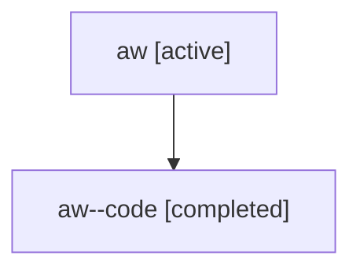

# Family: aw

[Agent Hoods](../README.md) / [bbugyi200](../users/bbugyi200/README.md) / [athena](../users/bbugyi200/machines/athena/README.md) / [aw](../users/bbugyi200/machines/athena/hoods/aw/README.md) / aw

Owner: `bbugyi200.athena` · Hood: `aw` · Members: 2

## Lineage

The diagram is an optional enhancement; the ordered table below contains the same lineage in accessible text.

| Role | Agent | State | Model / provider | Timing | Commits | Prompt | Chat |
|---|---|---|---|---|---:|---|---|
| root | aw | active | claude-fable-5 / claude | 2026-07-16T20:26:45.509056+00:00 | [1](../agents/bbugyi200.athena.aw/README.md#commits) | [Prompt](../agents/bbugyi200.athena.aw/prompt.md) | [Chat](../agents/bbugyi200.athena.aw/chat.md) |
| code | aw--code | completed | gpt-5.6-sol / codex | 2026-07-16T20:38:39.625886+00:00 | [1](../agents/bbugyi200.athena.aw--code/README.md#commits) | — | [Chat](../agents/bbugyi200.athena.aw--code/chat.md) |

## Commits

| Role | Repo | Commit | Subject | Committed |
|---|---|---|---|---|
| code | sase | [`2fd3c84`](https://github.com/sase-org/sase/commit/2fd3c84a703fd55c6883105f802ecfc2343c19dd) | feat(ace): highlight xprompts in agent panels | 2026-07-16 16:57:07 EDT |
| root | sase | [`2fd3c84`](https://github.com/sase-org/sase/commit/2fd3c84a703fd55c6883105f802ecfc2343c19dd) | feat(ace): highlight xprompts in agent panels | 2026-07-16 16:57:07 EDT |

## Neighbors

| Agent | Relation | State |
|---|---|---|
| [aw.f0](bbugyi200.athena.aw.f0.md) (family · 2) | descendant | active 1, completed 1 |
