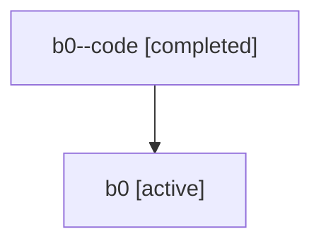

# Family: b0

[Agent Hoods](../README.md) / [bbugyi200](../users/bbugyi200/README.md) / [athena](../users/bbugyi200/machines/athena/README.md) / [b0](../users/bbugyi200/machines/athena/hoods/b0/README.md) / b0

Owner: `bbugyi200.athena` · Hood: `b0` · Members: 2

## Lineage

The diagram is an optional enhancement; the ordered table below contains the same lineage in accessible text.

| Role | Agent | State | Model / provider | Timing | Commits | Prompt | Chat |
|---|---|---|---|---|---:|---|---|
| code | b0--code | completed | gpt-5.6-sol / codex | 2026-07-16T20:56:10.850731+00:00 | [1](../agents/bbugyi200.athena.b0--code/README.md#commits) | — | [Chat](../agents/bbugyi200.athena.b0--code/chat.md) |
| root | b0 | active | gpt-5.6-sol / codex | 2026-07-16T20:50:02.070400+00:00 | 0 | [Prompt](../agents/bbugyi200.athena.b0/prompt.md) | [Chat](../agents/bbugyi200.athena.b0/chat.md) |

## Commits

| Role | Repo | Commit | Subject | Committed |
|---|---|---|---|---|
| code | sase | [`b02ae14`](https://github.com/sase-org/sase/commit/b02ae14fb4625e3940ae5e5d25835fd48ec6ba9e) | feat(ace): add selected panel folding mode | 2026-07-16 21:28:44 UTC |
