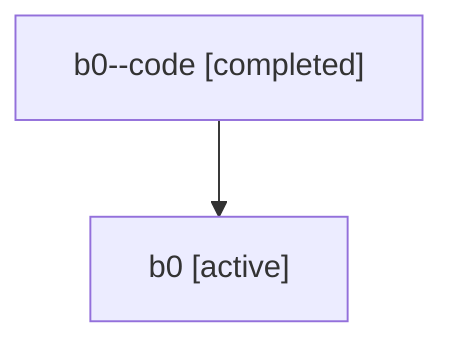

# Family: b0

Owner: `bbugyi200.athena` · Hood: `b0` · Members: 2

## Lineage

The diagram is an optional enhancement; the ordered table below contains the same lineage in accessible text.

| Role | Agent | State | Model / provider | Timing | Commits | Prompt | Chat |
|---|---|---|---|---|---:|---|---|
| code | b0--code | completed | gpt-5.6-sol / codex | 2026-07-16T20:56:10.850731+00:00 | 1 | — | [Chat](../agents/bbugyi200.athena.b0--code/chat.md) |
| root | b0 | active | gpt-5.6-sol / codex | 2026-07-16T20:50:02.070400+00:00 | 1 | [Prompt](../agents/bbugyi200.athena.b0/prompt.md) | [Chat](../agents/bbugyi200.athena.b0/chat.md) |
