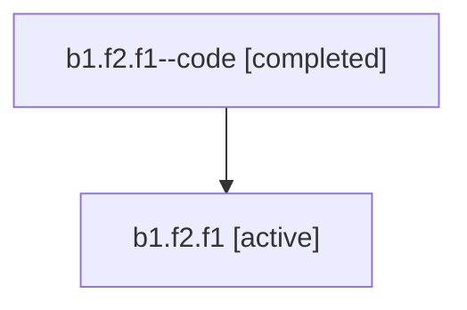

# Family: b1.f2.f1

[Agent Hoods](../README.md) / [bbugyi200](../users/bbugyi200/README.md) / [athena](../users/bbugyi200/machines/athena/README.md) / [b1](../users/bbugyi200/machines/athena/hoods/b1/README.md) / b1.f2.f1

Owner: `bbugyi200.athena` · Hood: `b1` · Members: 2

## Lineage

The diagram is an optional enhancement; the ordered table below contains the same lineage in accessible text.

| Role | Agent | State | Model / provider | Timing | Commits | Prompt | Chat |
|---|---|---|---|---|---:|---|---|
| code | b1.f2.f1--code | completed | gpt-5.6-sol / codex | 2026-07-16T22:27:02.913994+00:00 | [1](../agents/bbugyi200.athena.b1.f2.f1--code/README.md#commits) | — | [Chat](../agents/bbugyi200.athena.b1.f2.f1--code/chat.md) |
| root | b1.f2.f1 | active | opus / claude | 2026-07-16T22:15:07.962443+00:00 | [2](../agents/bbugyi200.athena.b1.f2.f1/README.md#commits) | [Prompt](../agents/bbugyi200.athena.b1.f2.f1/prompt.md) | [Chat](../agents/bbugyi200.athena.b1.f2.f1/chat.md) |

## Commits

| Role | Repo | Commit | Subject | Committed (UTC) |
|---|---|---|---|---|
| root | sase | [`6b84f2a`](https://github.com/sase-org/sase/commit/6b84f2add16e3e28af29837d2c6189ab9b76c1ed) | feat(ace): add ranked artifacts context lane | 2026-07-16 23:00:10 |
| code | sase | [`b296828`](https://github.com/sase-org/sase/commit/b29682808132418e06eb4601f7c6a7b6d2e2a715) | fix(ace): keep artifact fields under context navigation | 2026-07-16 23:11:44 |
| root | sase | [`b296828`](https://github.com/sase-org/sase/commit/b29682808132418e06eb4601f7c6a7b6d2e2a715) | fix(ace): keep artifact fields under context navigation | 2026-07-16 23:11:44 |

## Neighbors

| Agent | Relation | State |
|---|---|---|
| [b1.f2](bbugyi200.athena.b1.f2.md) (family · 2) | ancestor | active 1, completed 1 |
| [b1](bbugyi200.athena.b1.md) (family · 2) | ancestor | active 1, completed 1 |
| [b1.f2.f0](../agents/bbugyi200.athena.b1.f2.f0/README.md) | b1.f2 hood | active |
| [b1.f0](../agents/bbugyi200.athena.b1.f0/README.md) | b1 hood | active |
| [b1.f1](../agents/bbugyi200.athena.b1.f1/README.md) | b1 hood | active |
