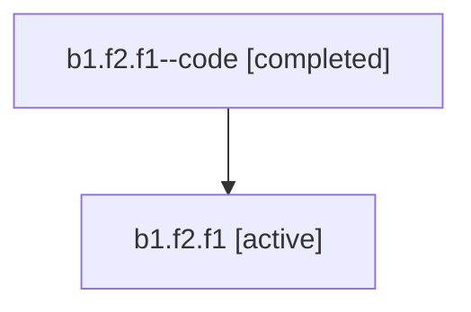

# Family: b1.f2.f1

Owner: `bbugyi200.athena` · Hood: `b1` · Members: 2

## Lineage

The diagram is an optional enhancement; the ordered table below contains the same lineage in accessible text.

| Role | Agent | State | Model / provider | Timing | Commits | Prompt | Chat |
|---|---|---|---|---|---:|---|---|
| code | b1.f2.f1--code | completed | gpt-5.6-sol / codex | 2026-07-16T22:27:02.913994+00:00 | 1 | — | [Chat](../agents/bbugyi200.athena.b1.f2.f1--code/chat.md) |
| root | b1.f2.f1 | active | opus / claude | 2026-07-16T22:15:07.962443+00:00 | 2 | [Prompt](../agents/bbugyi200.athena.b1.f2.f1/prompt.md) | [Chat](../agents/bbugyi200.athena.b1.f2.f1/chat.md) |
