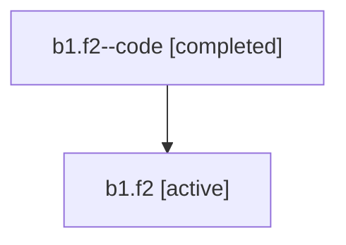

# Family: b1.f2

[Agent Hoods](../README.md) / [bbugyi200](../users/bbugyi200/README.md) / [athena](../users/bbugyi200/machines/athena/README.md) / [b1](../users/bbugyi200/machines/athena/hoods/b1/README.md) / b1.f2

Owner: `bbugyi200.athena` · Hood: `b1` · Members: 2

## Lineage

The diagram is an optional enhancement; the ordered table below contains the same lineage in accessible text.

| Role | Agent | State | Model / provider | Timing | Commits | Prompt | Chat |
|---|---|---|---|---|---:|---|---|
| code | b1.f2--code | completed | gpt-5.6-sol / codex | 2026-07-16T21:53:23.475129+00:00 | [1](../agents/bbugyi200.athena.b1.f2--code/README.md#commits) | — | [Chat](../agents/bbugyi200.athena.b1.f2--code/chat.md) |
| root | b1.f2 | active | claude-fable-5 / claude | 2026-07-16T21:42:26.843416+00:00 | [1](../agents/bbugyi200.athena.b1.f2/README.md#commits) | [Prompt](../agents/bbugyi200.athena.b1.f2/prompt.md) | [Chat](../agents/bbugyi200.athena.b1.f2/chat.md) |

## Commits

| Role | Repo | Commit | Subject | Committed (UTC) |
|---|---|---|---|---|
| code | sase | [`38760e2`](https://github.com/sase-org/sase/commit/38760e2f2eb9ef47bebbb1c89d4ec97624e8e598) | feat(ace): polish plan lane visuals | 2026-07-16 22:08:51 |
| root | sase | [`38760e2`](https://github.com/sase-org/sase/commit/38760e2f2eb9ef47bebbb1c89d4ec97624e8e598) | feat(ace): polish plan lane visuals | 2026-07-16 22:08:51 |

## Neighbors

| Agent | Relation | State |
|---|---|---|
| [b1](bbugyi200.athena.b1.md) (family · 2) | ancestor | active 1, completed 1 |
| [b1.f2.f0](../agents/bbugyi200.athena.b1.f2.f0/README.md) | descendant | active |
| [b1.f2.f1](bbugyi200.athena.b1.f2.f1.md) (family · 2) | descendant | active 1, completed 1 |
| [b1.f0](../agents/bbugyi200.athena.b1.f0/README.md) | b1 hood | active |
| [b1.f1](../agents/bbugyi200.athena.b1.f1/README.md) | b1 hood | active |
