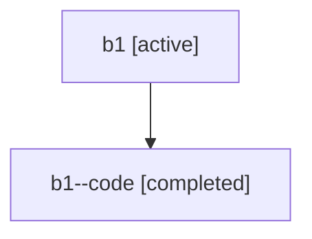

# Family: b1

[Agent Hoods](../README.md) / [bbugyi200](../users/bbugyi200/README.md) / [athena](../users/bbugyi200/machines/athena/README.md) / [b1](../users/bbugyi200/machines/athena/hoods/b1/README.md) / b1

Owner: `bbugyi200.athena` · Hood: `b1` · Members: 2

## Lineage

The diagram is an optional enhancement; the ordered table below contains the same lineage in accessible text.

| Role | Agent | State | Model / provider | Timing | Commits | Prompt | Chat |
|---|---|---|---|---|---:|---|---|
| root | b1 | active | opus / claude | 2026-07-16T20:59:50.611996+00:00 | 0 | [Prompt](../agents/bbugyi200.athena.b1/prompt.md) | [Chat](../agents/bbugyi200.athena.b1/chat.md) |
| code | b1--code | completed | gpt-5.6-sol / codex | 2026-07-16T21:09:13.460416+00:00 | [1](../agents/bbugyi200.athena.b1--code/README.md#commits) | — | [Chat](../agents/bbugyi200.athena.b1--code/chat.md) |

## Commits

| Role | Repo | Commit | Subject | Committed |
|---|---|---|---|---|
| code | sase | [`125f342`](https://github.com/sase-org/sase/commit/125f342cb18e2a5bee33370948a204733c25e948) | feat(ace): merge plan into SASE context | 2026-07-16 21:35:38 UTC |

## Neighbors

| Agent | Relation | State |
|---|---|---|
| [b1.f0](../agents/bbugyi200.athena.b1.f0/README.md) | descendant | active |
| [b1.f1](../agents/bbugyi200.athena.b1.f1/README.md) | descendant | active |
| [b1.f2](bbugyi200.athena.b1.f2.md) (family · 2) | descendant | active 1, completed 1 |
| [b1.f2.f0](../agents/bbugyi200.athena.b1.f2.f0/README.md) | descendant | active |
| [b1.f2.f1](bbugyi200.athena.b1.f2.f1.md) (family · 2) | descendant | active 1, completed 1 |
