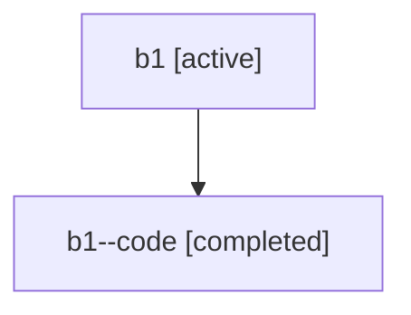

# Family: b1

Owner: `bbugyi200.athena` · Hood: `b1` · Members: 2

## Lineage

The diagram is an optional enhancement; the ordered table below contains the same lineage in accessible text.

| Role | Agent | State | Model / provider | Timing | Commits | Prompt | Chat |
|---|---|---|---|---|---:|---|---|
| root | b1 | active | opus / claude | 2026-07-16T20:59:50.611996+00:00 | 1 | [Prompt](../agents/bbugyi200.athena.b1/prompt.md) | [Chat](../agents/bbugyi200.athena.b1/chat.md) |
| code | b1--code | completed | gpt-5.6-sol / codex | 2026-07-16T21:09:13.460416+00:00 | 1 | — | [Chat](../agents/bbugyi200.athena.b1--code/chat.md) |
