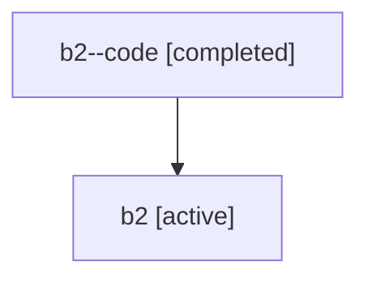

# Family: b2

Owner: `bbugyi200.athena` · Hood: `b2` · Members: 2

## Lineage

The diagram is an optional enhancement; the ordered table below contains the same lineage in accessible text.

| Role | Agent | State | Model / provider | Timing | Commits | Prompt | Chat |
|---|---|---|---|---|---:|---|---|
| code | b2--code | completed | gpt-5.6-sol / codex | 2026-07-16T21:40:42.247604+00:00 | 0 | — | [Chat](../agents/bbugyi200.athena.b2--code/chat.md) |
| root | b2 | active | claude-fable-5 / claude | 2026-07-16T21:25:03.179090+00:00 | 1 | [Prompt](../agents/bbugyi200.athena.b2/prompt.md) | [Chat](../agents/bbugyi200.athena.b2/chat.md) |
