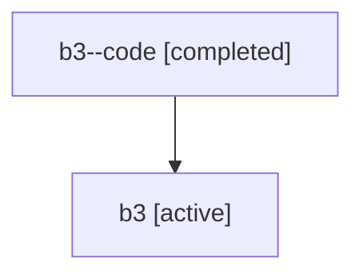

# Family: b3

[Agent Hoods](../README.md) / [bbugyi200](../users/bbugyi200/README.md) / [athena](../users/bbugyi200/machines/athena/README.md) / [b3](../users/bbugyi200/machines/athena/hoods/b3/README.md) / b3

Owner: `bbugyi200.athena` · Hood: `b3` · Members: 2

## Lineage

The diagram is an optional enhancement; the ordered table below contains the same lineage in accessible text.

| Role | Agent | State | Model / provider | Timing | Commits | Prompt | Chat |
|---|---|---|---|---|---:|---|---|
| code | b3--code | completed | gpt-5.6-sol / codex | 2026-07-16T21:44:31.933326+00:00 | 0 | — | [Chat](../agents/bbugyi200.athena.b3--code/chat.md) |
| root | b3 | active | gpt-5.6-sol / codex | 2026-07-16T21:35:14.812441+00:00 | [1](../agents/bbugyi200.athena.b3/README.md#commits) | [Prompt](../agents/bbugyi200.athena.b3/prompt.md) | [Chat](../agents/bbugyi200.athena.b3/chat.md) |

## Commits

| Role | Repo | Commit | Subject | Committed (UTC) |
|---|---|---|---|---|
| root | sase | [`a434e09`](https://github.com/sase-org/sase/commit/a434e09e675c08adb8567cb342add9add087e120) | feat(ace): navigate agent metadata sections | 2026-07-16 22:30:03 |
