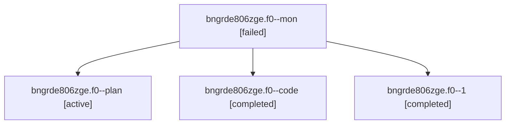

# Family: bngrde806zge.f0

[Agent Hoods](../README.md) / [bbugyi200](../users/bbugyi200/README.md) / [athena](../users/bbugyi200/machines/athena/README.md) / [bngrde806zge](../users/bbugyi200/machines/athena/hoods/bngrde806zge/README.md) / bngrde806zge.f0

Owner: `bbugyi200.athena` · Hood: `bngrde806zge` · Members: 4

## Lineage

The diagram is an optional enhancement; the ordered table below contains the same lineage in accessible text.

| Role | Agent | State | Model / provider | Timing | Commits | Prompt | Chat |
|---|---|---|---|---|---:|---|---|
| mon | bngrde806zge.f0--mon | failed | sonnet / claude | 2026-08-25T18:10:51.774082+00:00 | 0 | — | [Chat](../agents/bbugyi200.athena.bngrde806zge.f0--mon/chat.md) |
| plan | bngrde806zge.f0--plan | active | opus / claude | 2026-08-25T16:55:50.157448+00:00 | 0 | [Prompt](../agents/bbugyi200.athena.bngrde806zge.f0--plan/prompt.md) | [Chat](../agents/bbugyi200.athena.bngrde806zge.f0--plan/chat.md) |
| code | bngrde806zge.f0--code | completed | sonnet / claude | 2026-08-25T17:50:22.489993+00:00 → 2026-08-25T18:11:01.569481+00:00 | 0 | — | [Chat](../agents/bbugyi200.athena.bngrde806zge.f0--code/chat.md) |
| 1 | bngrde806zge.f0--1 | completed | sonnet / claude | 2026-08-25T18:28:48.347133+00:00 → 2026-08-25T18:34:41.466543+00:00 | 0 | [Prompt](../agents/bbugyi200.athena.bngrde806zge.f0--1/prompt.md) | [Chat](../agents/bbugyi200.athena.bngrde806zge.f0--1/chat.md) |

## Commits

| Role | Repo | Commit | Subject | Committed |
|---|---|---|---|---|
| — | sase | [`bb429cf`](https://github.com/sase-org/sase/commit/bb429cf3756a82462340be3287a3957eac4cd8cf) | test(agent-catalog): dedup AgentCatalogRow factories and replace mount page.pause() with an explicit wait\_for | 2026-08-25 14:32:12 EDT |
