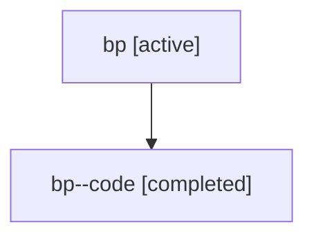

# Family: bp

Owner: `bbugyi200.athena` · Hood: `bp` · Members: 2

## Lineage

The diagram is an optional enhancement; the ordered table below contains the same lineage in accessible text.

| Role | Agent | State | Model / provider | Timing | Commits | Prompt | Chat |
|---|---|---|---|---|---:|---|---|
| root | bp | active | claude-fable-5 / claude | 2026-07-17T12:26:32.961900+00:00 | 1 | [Prompt](../agents/bbugyi200.athena.bp/prompt.md) | [Chat](../agents/bbugyi200.athena.bp/chat.md) |
| code | bp--code | completed | gpt-5.6-sol / codex | 2026-07-17T12:39:31.700167+00:00 | 0 | — | [Chat](../agents/bbugyi200.athena.bp--code/chat.md) |
