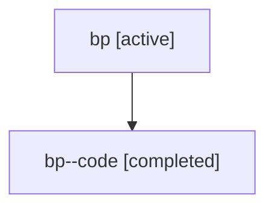

# Family: bp

[Agent Hoods](../README.md) / [bbugyi200](../users/bbugyi200/README.md) / [athena](../users/bbugyi200/machines/athena/README.md) / [bp](../users/bbugyi200/machines/athena/hoods/bp/README.md) / bp

Owner: `bbugyi200.athena` · Hood: `bp` · Members: 2

## Lineage

The diagram is an optional enhancement; the ordered table below contains the same lineage in accessible text.

| Role | Agent | State | Model / provider | Timing | Commits | Prompt | Chat |
|---|---|---|---|---|---:|---|---|
| root | bp | active | claude-fable-5 / claude | 2026-07-17T12:26:32.961900+00:00 | [1](../agents/bbugyi200.athena.bp/README.md#commits) | [Prompt](../agents/bbugyi200.athena.bp/prompt.md) | [Chat](../agents/bbugyi200.athena.bp/chat.md) |
| code | bp--code | completed | gpt-5.6-sol / codex | 2026-07-17T12:39:31.700167+00:00 | 0 | — | [Chat](../agents/bbugyi200.athena.bp--code/chat.md) |

## Commits

| Role | Repo | Commit | Subject | Committed |
|---|---|---|---|---|
| root | sase | [`ac92d6a`](https://github.com/sase-org/sase/commit/ac92d6adeae089f629f7ec748bbb821730093723) | docs: redesign README landing page | 2026-07-17 08:56:46 EDT |
