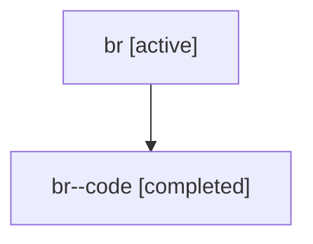

# Family: br

[Agent Hoods](../README.md) / [bbugyi200](../users/bbugyi200/README.md) / [athena](../users/bbugyi200/machines/athena/README.md) / [br](../users/bbugyi200/machines/athena/hoods/br/README.md) / br

Owner: `bbugyi200.athena` · Hood: `br` · Members: 2

## Lineage

The diagram is an optional enhancement; the ordered table below contains the same lineage in accessible text.

| Role | Agent | State | Model / provider | Timing | Commits | Prompt | Chat |
|---|---|---|---|---|---:|---|---|
| root | br | active | gpt-5.6-sol / codex | 2026-07-17T12:37:52.861646+00:00 | [1](../agents/bbugyi200.athena.br/README.md#commits) | [Prompt](../agents/bbugyi200.athena.br/prompt.md) | [Chat](../agents/bbugyi200.athena.br/chat.md) |
| code | br--code | completed | gpt-5.6-sol / codex | 2026-07-17T12:47:02.974379+00:00 | [1](../agents/bbugyi200.athena.br--code/README.md#commits) | — | [Chat](../agents/bbugyi200.athena.br--code/chat.md) |

## Commits

| Role | Repo | Commit | Subject | Committed |
|---|---|---|---|---|
| code | sase | [`abf5cdc`](https://github.com/sase-org/sase/commit/abf5cdcd51a2d3d40f2f446d4019bedb336aafbc) | feat(ace): add fast navigation to artifact lists | 2026-07-17 09:24:43 EDT |
| root | sase | [`abf5cdc`](https://github.com/sase-org/sase/commit/abf5cdcd51a2d3d40f2f446d4019bedb336aafbc) | feat(ace): add fast navigation to artifact lists | 2026-07-17 09:24:43 EDT |

## Neighbors

| Agent | Relation | State |
|---|---|---|
| [br.w0](bbugyi200.athena.br.w0.md) (family · 2) | descendant | active 1, completed 1 |
