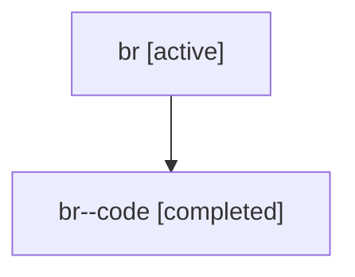

# Family: br

Owner: `bbugyi200.athena` · Hood: `br` · Members: 2

## Lineage

The diagram is an optional enhancement; the ordered table below contains the same lineage in accessible text.

| Role | Agent | State | Model / provider | Timing | Commits | Prompt | Chat |
|---|---|---|---|---|---:|---|---|
| root | br | active | gpt-5.6-sol / codex | 2026-07-17T12:37:52.861646+00:00 | 1 | [Prompt](../agents/bbugyi200.athena.br/prompt.md) | [Chat](../agents/bbugyi200.athena.br/chat.md) |
| code | br--code | completed | gpt-5.6-sol / codex | 2026-07-17T12:47:02.974379+00:00 | 1 | — | [Chat](../agents/bbugyi200.athena.br--code/chat.md) |
