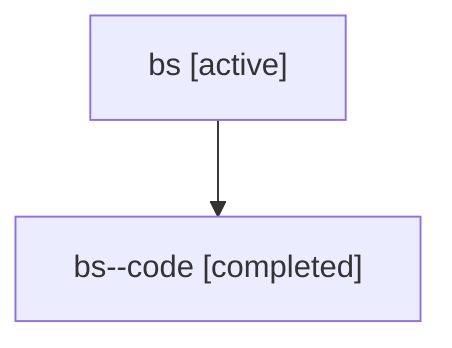

# Family: bs

Owner: `bbugyi200.athena` · Hood: `bs` · Members: 2

## Lineage

The diagram is an optional enhancement; the ordered table below contains the same lineage in accessible text.

| Role | Agent | State | Model / provider | Timing | Commits | Prompt | Chat |
|---|---|---|---|---|---:|---|---|
| root | bs | active | gpt-5.6-sol / codex | 2026-07-17T12:58:18.410654+00:00 | 1 | [Prompt](../agents/bbugyi200.athena.bs/prompt.md) | [Chat](../agents/bbugyi200.athena.bs/chat.md) |
| code | bs--code | completed | gpt-5.6-sol / codex | 2026-07-17T13:02:18.432981+00:00 | 0 | — | [Chat](../agents/bbugyi200.athena.bs--code/chat.md) |
