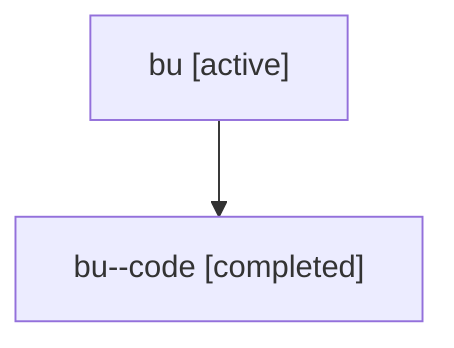

# Family: bu

Owner: `bbugyi200.athena` · Hood: `bu` · Members: 2

## Lineage

The diagram is an optional enhancement; the ordered table below contains the same lineage in accessible text.

| Role | Agent | State | Model / provider | Timing | Commits | Prompt | Chat |
|---|---|---|---|---|---:|---|---|
| root | bu | active | claude-fable-5 / claude | 2026-07-17T13:05:10.891985+00:00 | 1 | [Prompt](../agents/bbugyi200.athena.bu/prompt.md) | [Chat](../agents/bbugyi200.athena.bu/chat.md) |
| code | bu--code | completed | gpt-5.6-sol / codex | 2026-07-17T13:14:38.173203+00:00 | 1 | — | [Chat](../agents/bbugyi200.athena.bu--code/chat.md) |
