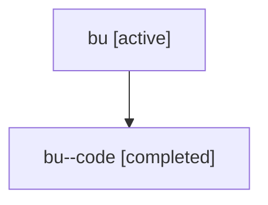

# Family: bu

[Agent Hoods](../README.md) / [bbugyi200](../users/bbugyi200/README.md) / [athena](../users/bbugyi200/machines/athena/README.md) / [bu](../users/bbugyi200/machines/athena/hoods/bu/README.md) / bu

Owner: `bbugyi200.athena` · Hood: `bu` · Members: 2

## Lineage

The diagram is an optional enhancement; the ordered table below contains the same lineage in accessible text.

| Role | Agent | State | Model / provider | Timing | Commits | Prompt | Chat |
|---|---|---|---|---|---:|---|---|
| root | bu | active | claude-fable-5 / claude | 2026-07-17T13:05:10.891985+00:00 | [1](../agents/bbugyi200.athena.bu/README.md#commits) | [Prompt](../agents/bbugyi200.athena.bu/prompt.md) | [Chat](../agents/bbugyi200.athena.bu/chat.md) |
| code | bu--code | completed | gpt-5.6-sol / codex | 2026-07-17T13:14:38.173203+00:00 | [1](../agents/bbugyi200.athena.bu--code/README.md#commits) | — | [Chat](../agents/bbugyi200.athena.bu--code/chat.md) |

## Commits

| Role | Repo | Commit | Subject | Committed |
|---|---|---|---|---|
| code | sase | [`2cab7b0`](https://github.com/sase-org/sase/commit/2cab7b07973b70291a6c923992968ec45243586e) | feat(ace): add gate debug view | 2026-07-17 10:08:28 EDT |
| root | sase | [`2cab7b0`](https://github.com/sase-org/sase/commit/2cab7b07973b70291a6c923992968ec45243586e) | feat(ace): add gate debug view | 2026-07-17 10:08:28 EDT |

## Neighbors

| Agent | Relation | State |
|---|---|---|
| [bu.w1](bbugyi200.athena.bu.w1.md) (family · 2) | descendant | active 1, completed 1 |
