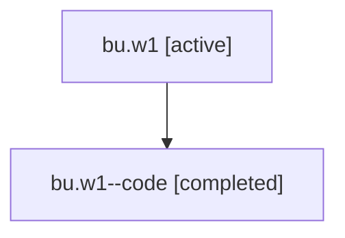

# Family: bu.w1

[Agent Hoods](../README.md) / [bbugyi200](../users/bbugyi200/README.md) / [athena](../users/bbugyi200/machines/athena/README.md) / [bu](../users/bbugyi200/machines/athena/hoods/bu/README.md) / bu.w1

Owner: `bbugyi200.athena` · Hood: `bu` · Members: 2

## Lineage

The diagram is an optional enhancement; the ordered table below contains the same lineage in accessible text.

| Role | Agent | State | Model / provider | Timing | Commits | Prompt | Chat |
|---|---|---|---|---|---:|---|---|
| root | bu.w1 | active | gpt-5.6-sol / codex | 2026-07-17T14:08:59.066295+00:00 | 0 | [Prompt](../agents/bbugyi200.athena.bu.w1/prompt.md) | [Chat](../agents/bbugyi200.athena.bu.w1/chat.md) |
| code | bu.w1--code | completed | gpt-5.6-sol / codex | 2026-07-17T14:21:17.189638+00:00 | [1](../agents/bbugyi200.athena.bu.w1--code/README.md#commits) | — | [Chat](../agents/bbugyi200.athena.bu.w1--code/chat.md) |

## Commits

| Role | Repo | Commit | Subject | Committed |
|---|---|---|---|---|
| code | sase | [`d5cf13b`](https://github.com/sase-org/sase/commit/d5cf13b23278165b87b3ed48ff8f9ba1eca27635) | feat(tui): add custom gate command keymaps | 2026-07-17 14:30:00 UTC |

## Neighbors

| Agent | Relation | State |
|---|---|---|
| [bu](bbugyi200.athena.bu.md) (family · 2) | ancestor | active 1, completed 1 |
