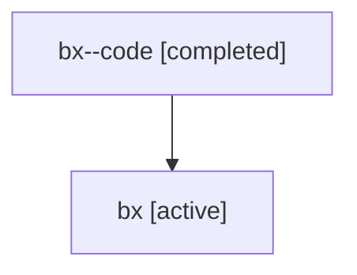

# Family: bx

Owner: `bbugyi200.athena` · Hood: `bx` · Members: 2

## Lineage

The diagram is an optional enhancement; the ordered table below contains the same lineage in accessible text.

| Role | Agent | State | Model / provider | Timing | Commits | Prompt | Chat |
|---|---|---|---|---|---:|---|---|
| code | bx--code | completed | gpt-5.6-sol / codex | 2026-07-17T14:44:40.597919+00:00 | 0 | — | [Chat](../agents/bbugyi200.athena.bx--code/chat.md) |
| root | bx | active | claude-fable-5 / claude | 2026-07-17T14:30:18.600227+00:00 | 1 | [Prompt](../agents/bbugyi200.athena.bx/prompt.md) | [Chat](../agents/bbugyi200.athena.bx/chat.md) |
