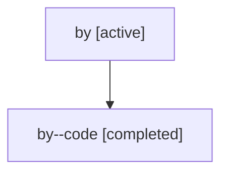

# Family: by

[Agent Hoods](../README.md) / [bbugyi200](../users/bbugyi200/README.md) / [athena](../users/bbugyi200/machines/athena/README.md) / [by](../users/bbugyi200/machines/athena/hoods/by/README.md) / by

Owner: `bbugyi200.athena` · Hood: `by` · Members: 2

## Lineage

The diagram is an optional enhancement; the ordered table below contains the same lineage in accessible text.

| Role | Agent | State | Model / provider | Timing | Commits | Prompt | Chat |
|---|---|---|---|---|---:|---|---|
| root | by | active | claude-fable-5 / claude | 2026-07-17T14:41:01.524023+00:00 | 0 | [Prompt](../agents/bbugyi200.athena.by/prompt.md) | [Chat](../agents/bbugyi200.athena.by/chat.md) |
| code | by--code | completed | gpt-5.6-sol / codex | 2026-07-17T14:48:36.829055+00:00 | [1](../agents/bbugyi200.athena.by--code/README.md#commits) | — | [Chat](../agents/bbugyi200.athena.by--code/chat.md) |

## Commits

| Role | Repo | Commit | Subject | Committed |
|---|---|---|---|---|
| code | sase | [`c9c8131`](https://github.com/sase-org/sase/commit/c9c81317859bd220dc6839167d0dfd62b71e7dfe) | feat(plan): guide phase description authoring | 2026-07-17 11:07:22 EDT |
