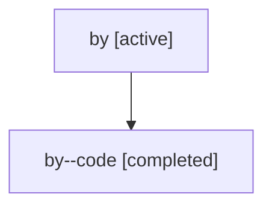

# Family: by

Owner: `bbugyi200.athena` · Hood: `by` · Members: 2

## Lineage

The diagram is an optional enhancement; the ordered table below contains the same lineage in accessible text.

| Role | Agent | State | Model / provider | Timing | Commits | Prompt | Chat |
|---|---|---|---|---|---:|---|---|
| root | by | active | claude-fable-5 / claude | 2026-07-17T14:41:01.524023+00:00 | 1 | [Prompt](../agents/bbugyi200.athena.by/prompt.md) | [Chat](../agents/bbugyi200.athena.by/chat.md) |
| code | by--code | completed | gpt-5.6-sol / codex | 2026-07-17T14:48:36.829055+00:00 | 1 | — | [Chat](../agents/bbugyi200.athena.by--code/chat.md) |
