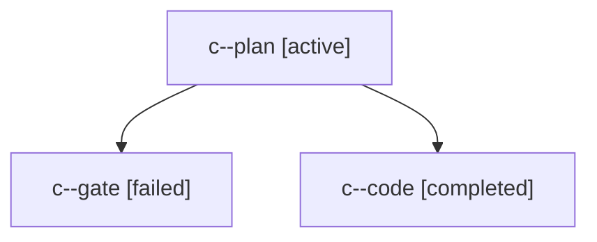

# Family: c

[Agent Hoods](../README.md) / [bbugyi200](../users/bbugyi200/README.md) / [athena](../users/bbugyi200/machines/athena/README.md) / [c](../users/bbugyi200/machines/athena/hoods/c/README.md) / c

Owner: `bbugyi200.athena` · Hood: `c` · Members: 3

## Lineage

The diagram is an optional enhancement; the ordered table below contains the same lineage in accessible text.

| Role | Agent | State | Model / provider | Timing | Commits | Prompt | Chat |
|---|---|---|---|---|---:|---|---|
| plan | c--plan | active | opus / claude | 2026-09-13T08:50:16.786919+00:00 | 0 | [Prompt](../agents/bbugyi200.athena.c--plan/prompt.md) | [Chat](../agents/bbugyi200.athena.c--plan/chat.md) |
| gate | c--gate | failed | opus / claude | 2026-09-13T09:03:20.724225+00:00 → 2026-09-13T09:03:53.787928+00:00 | 0 | — | [Chat](../agents/bbugyi200.athena.c--gate/chat.md) |
| code | c--code | completed | grok-4.6 / grok | 2026-09-13T09:04:00.985997+00:00 → 2026-09-13T09:47:34.835612+00:00 | [1](../agents/bbugyi200.athena.c--code/README.md#commits) | [Prompt](../agents/bbugyi200.athena.c--code/prompt.md) | [Chat](../agents/bbugyi200.athena.c--code/chat.md) |

## Commits

| Role | Repo | Commit | Subject | Committed |
|---|---|---|---|---|
| — | sase | [`c5cb304`](https://github.com/sase-org/sase/commit/c5cb3044011e045216dfe08f3f72c8bd27a38444) | chore: Add SDD prompt and plan for prs\_tab\_onboarding | 2026-07-03 13:37:30 EDT |
| — | sase | [`5ab9907`](https://github.com/sase-org/sase/commit/5ab9907f2b45b34300c36e29c2a4a65a87427258) | feat(tui): add PRs onboarding empty state | 2026-07-03 15:17:50 EDT |
| code | sase | [`73e337f`](https://github.com/sase-org/sase/commit/73e337ff271f91ccc4a20c9085a32dc8d1dd10f4) | fix: stop stray sase project from shadowing bead resolution | 2026-09-13 05:45:37 EDT |

## Neighbors

| Agent | Relation | State |
|---|---|---|
| [c.w1](../agents/bbugyi200.athena.c.w1/README.md) | descendant | completed |
