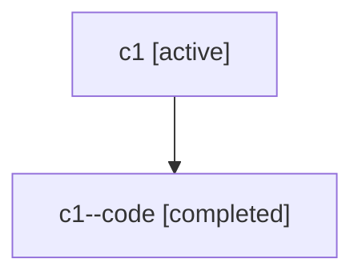

# Family: c1

[Agent Hoods](../README.md) / [bbugyi200](../users/bbugyi200/README.md) / [athena](../users/bbugyi200/machines/athena/README.md) / [c1](../users/bbugyi200/machines/athena/hoods/c1/README.md) / c1

Owner: `bbugyi200.athena` · Hood: `c1` · Members: 2

## Lineage

The diagram is an optional enhancement; the ordered table below contains the same lineage in accessible text.

| Role | Agent | State | Model / provider | Timing | Commits | Prompt | Chat |
|---|---|---|---|---|---:|---|---|
| root | c1 | active | gpt-5.6-sol / codex | 2026-07-17T15:21:16.090962+00:00 | [1](../agents/bbugyi200.athena.c1/README.md#commits) | [Prompt](../agents/bbugyi200.athena.c1/prompt.md) | [Chat](../agents/bbugyi200.athena.c1/chat.md) |
| code | c1--code | completed | gpt-5.6-sol / codex | 2026-07-17T15:36:42.126368+00:00 | [1](../agents/bbugyi200.athena.c1--code/README.md#commits) | — | [Chat](../agents/bbugyi200.athena.c1--code/chat.md) |

## Commits

| Role | Repo | Commit | Subject | Committed (UTC) |
|---|---|---|---|---|
| code | sase | [`05dc1db`](https://github.com/sase-org/sase/commit/05dc1db089965775e5f20be4dcacda66a60411a4) | fix: contain scrollable update commit previews | 2026-07-17 16:15:15 |
| root | sase | [`05dc1db`](https://github.com/sase-org/sase/commit/05dc1db089965775e5f20be4dcacda66a60411a4) | fix: contain scrollable update commit previews | 2026-07-17 16:15:15 |
