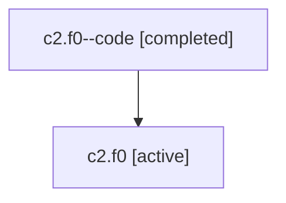

# Family: c2.f0

[Agent Hoods](../README.md) / [bbugyi200](../users/bbugyi200/README.md) / [athena](../users/bbugyi200/machines/athena/README.md) / [c2](../users/bbugyi200/machines/athena/hoods/c2/README.md) / c2.f0

Owner: `bbugyi200.athena` · Hood: `c2` · Members: 2

## Lineage

The diagram is an optional enhancement; the ordered table below contains the same lineage in accessible text.

| Role | Agent | State | Model / provider | Timing | Commits | Prompt | Chat |
|---|---|---|---|---|---:|---|---|
| code | c2.f0--code | completed | gpt-5.6-sol / codex | 2026-07-17T16:25:41.637091+00:00 | [1](../agents/bbugyi200.athena.c2.f0--code/README.md#commits) | — | [Chat](../agents/bbugyi200.athena.c2.f0--code/chat.md) |
| root | c2.f0 | active | gpt-5.6-sol / codex | 2026-07-17T16:18:45.009646+00:00 | 0 | [Prompt](../agents/bbugyi200.athena.c2.f0/prompt.md) | [Chat](../agents/bbugyi200.athena.c2.f0/chat.md) |

## Commits

| Role | Repo | Commit | Subject | Committed |
|---|---|---|---|---|
| code | sase | [`de9d360`](https://github.com/sase-org/sase/commit/de9d36014a20c6795a557dae1435b4b25fa22471) | fix(tui): count effective agents in headline | 2026-07-17 16:41:49 UTC |

## Neighbors

| Agent | Relation | State |
|---|---|---|
| [c2](bbugyi200.athena.c2.md) (family · 2) | ancestor | active 1, completed 1 |
