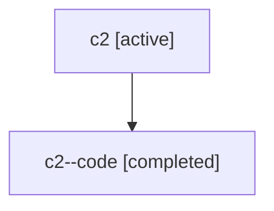

# Family: c2

[Agent Hoods](../README.md) / [bbugyi200](../users/bbugyi200/README.md) / [athena](../users/bbugyi200/machines/athena/README.md) / [c2](../users/bbugyi200/machines/athena/hoods/c2/README.md) / c2

Owner: `bbugyi200.athena` · Hood: `c2` · Members: 2

## Lineage

The diagram is an optional enhancement; the ordered table below contains the same lineage in accessible text.

| Role | Agent | State | Model / provider | Timing | Commits | Prompt | Chat |
|---|---|---|---|---|---:|---|---|
| root | c2 | active | gpt-5.6-sol / codex | 2026-07-17T15:36:01.742409+00:00 | [1](../agents/bbugyi200.athena.c2/README.md#commits) | [Prompt](../agents/bbugyi200.athena.c2/prompt.md) | [Chat](../agents/bbugyi200.athena.c2/chat.md) |
| code | c2--code | completed | gpt-5.6-sol / codex | 2026-07-17T15:45:37.033809+00:00 | 0 | — | [Chat](../agents/bbugyi200.athena.c2--code/chat.md) |

## Commits

| Role | Repo | Commit | Subject | Committed |
|---|---|---|---|---|
| root | sase | [`4dc5ca6`](https://github.com/sase-org/sase/commit/4dc5ca609890eee56a780793e997709de57de52b) | fix(ace): project parallel family status counts | 2026-07-17 12:09:10 EDT |

## Neighbors

| Agent | Relation | State |
|---|---|---|
| [c2.f0](bbugyi200.athena.c2.f0.md) (family · 2) | descendant | active 1, completed 1 |
