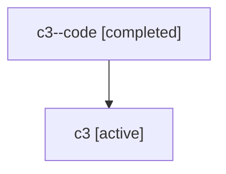

# Family: c3

[Agent Hoods](../README.md) / [bbugyi200](../users/bbugyi200/README.md) / [athena](../users/bbugyi200/machines/athena/README.md) / [c3](../users/bbugyi200/machines/athena/hoods/c3/README.md) / c3

Owner: `bbugyi200.athena` · Hood: `c3` · Members: 2

## Lineage

The diagram is an optional enhancement; the ordered table below contains the same lineage in accessible text.

| Role | Agent | State | Model / provider | Timing | Commits | Prompt | Chat |
|---|---|---|---|---|---:|---|---|
| code | c3--code | completed | gpt-5.6-sol / codex | 2026-07-17T16:15:12.162436+00:00 | [1](../agents/bbugyi200.athena.c3--code/README.md#commits) | — | [Chat](../agents/bbugyi200.athena.c3--code/chat.md) |
| root | c3 | active | gpt-5.6-sol / codex | 2026-07-17T16:03:26.162747+00:00 | [1](../agents/bbugyi200.athena.c3/README.md#commits) | [Prompt](../agents/bbugyi200.athena.c3/prompt.md) | [Chat](../agents/bbugyi200.athena.c3/chat.md) |

## Commits

| Role | Repo | Commit | Subject | Committed (UTC) |
|---|---|---|---|---|
| code | sase | [`786cdb7`](https://github.com/sase-org/sase/commit/786cdb7f7bfa71d9bef874be15c27062611676ac) | fix(ace): show retrying status before the next attempt | 2026-07-17 16:41:21 |
| root | sase | [`786cdb7`](https://github.com/sase-org/sase/commit/786cdb7f7bfa71d9bef874be15c27062611676ac) | fix(ace): show retrying status before the next attempt | 2026-07-17 16:41:21 |
