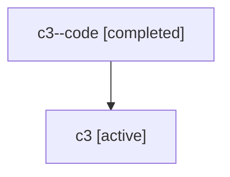

# Family: c3

Owner: `bbugyi200.athena` · Hood: `c3` · Members: 2

## Lineage

The diagram is an optional enhancement; the ordered table below contains the same lineage in accessible text.

| Role | Agent | State | Model / provider | Timing | Commits | Prompt | Chat |
|---|---|---|---|---|---:|---|---|
| code | c3--code | completed | gpt-5.6-sol / codex | 2026-07-17T16:15:12.162436+00:00 | 1 | — | [Chat](../agents/bbugyi200.athena.c3--code/chat.md) |
| root | c3 | active | gpt-5.6-sol / codex | 2026-07-17T16:03:26.162747+00:00 | 1 | [Prompt](../agents/bbugyi200.athena.c3/prompt.md) | [Chat](../agents/bbugyi200.athena.c3/chat.md) |
