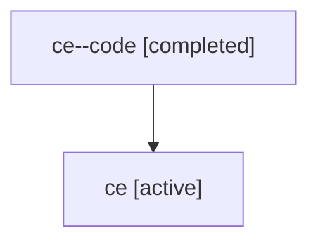

# Family: ce

Owner: `bbugyi200.athena` · Hood: `ce` · Members: 2

## Lineage

The diagram is an optional enhancement; the ordered table below contains the same lineage in accessible text.

| Role | Agent | State | Model / provider | Timing | Commits | Prompt | Chat |
|---|---|---|---|---|---:|---|---|
| code | ce--code | completed | gpt-5.6-sol / codex | 2026-07-17T18:35:17.177125+00:00 | 1 | — | [Chat](../agents/bbugyi200.athena.ce--code/chat.md) |
| root | ce | active | gpt-5.6-sol / codex | 2026-07-17T18:19:47.246549+00:00 | 1 | [Prompt](../agents/bbugyi200.athena.ce/prompt.md) | [Chat](../agents/bbugyi200.athena.ce/chat.md) |
