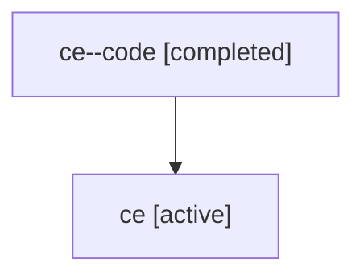

# Family: ce

[Agent Hoods](../README.md) / [bbugyi200](../users/bbugyi200/README.md) / [athena](../users/bbugyi200/machines/athena/README.md) / [ce](../users/bbugyi200/machines/athena/hoods/ce/README.md) / ce

Owner: `bbugyi200.athena` · Hood: `ce` · Members: 2

## Lineage

The diagram is an optional enhancement; the ordered table below contains the same lineage in accessible text.

| Role | Agent | State | Model / provider | Timing | Commits | Prompt | Chat |
|---|---|---|---|---|---:|---|---|
| code | ce--code | completed | gpt-5.6-sol / codex | 2026-07-17T18:35:17.177125+00:00 | [1](../agents/bbugyi200.athena.ce--code/README.md#commits) | — | [Chat](../agents/bbugyi200.athena.ce--code/chat.md) |
| root | ce | active | gpt-5.6-sol / codex | 2026-07-17T18:19:47.246549+00:00 | [1](../agents/bbugyi200.athena.ce/README.md#commits) | [Prompt](../agents/bbugyi200.athena.ce/prompt.md) | [Chat](../agents/bbugyi200.athena.ce/chat.md) |

## Commits

| Role | Repo | Commit | Subject | Committed |
|---|---|---|---|---|
| code | sase | [`328b3b5`](https://github.com/sase-org/sase/commit/328b3b5208c5a005b1db105669769e29f27f7338) | feat(ace): summarize collapsed agent panels | 2026-07-17 15:28:36 EDT |
| root | sase | [`328b3b5`](https://github.com/sase-org/sase/commit/328b3b5208c5a005b1db105669769e29f27f7338) | feat(ace): summarize collapsed agent panels | 2026-07-17 15:28:36 EDT |
