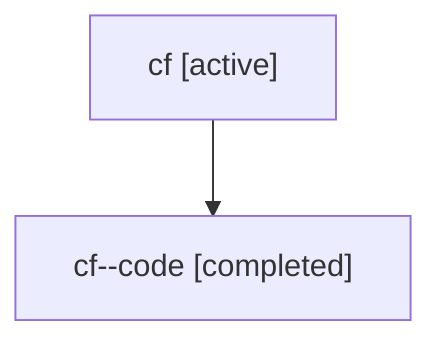

# Family: cf

[Agent Hoods](../README.md) / [bbugyi200](../users/bbugyi200/README.md) / [athena](../users/bbugyi200/machines/athena/README.md) / [cf](../users/bbugyi200/machines/athena/hoods/cf/README.md) / cf

Owner: `bbugyi200.athena` · Hood: `cf` · Members: 2

## Lineage

The diagram is an optional enhancement; the ordered table below contains the same lineage in accessible text.

| Role | Agent | State | Model / provider | Timing | Commits | Prompt | Chat |
|---|---|---|---|---|---:|---|---|
| root | cf | active | gpt-5.6-sol / codex | 2026-07-17T18:25:50.720908+00:00 | 0 | [Prompt](../agents/bbugyi200.athena.cf/prompt.md) | [Chat](../agents/bbugyi200.athena.cf/chat.md) |
| code | cf--code | completed | gpt-5.6-sol / codex | 2026-07-17T18:37:31.387311+00:00 | [1](../agents/bbugyi200.athena.cf--code/README.md#commits) | — | [Chat](../agents/bbugyi200.athena.cf--code/chat.md) |

## Commits

| Role | Repo | Commit | Subject | Committed |
|---|---|---|---|---|
| code | sase | [`16c6bcd`](https://github.com/sase-org/sase/commit/16c6bcd996919bd5a401a4ced3adde92e3c2be88) | fix(ace): require explicit agent panel groups | 2026-07-17 14:50:56 EDT |
