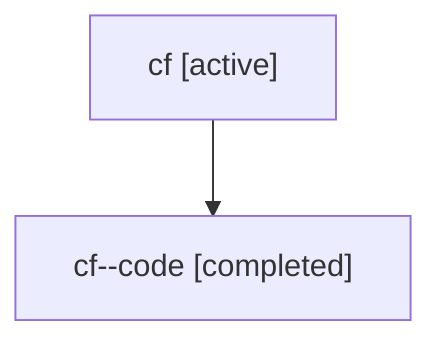

# Family: cf

Owner: `bbugyi200.athena` · Hood: `cf` · Members: 2

## Lineage

The diagram is an optional enhancement; the ordered table below contains the same lineage in accessible text.

| Role | Agent | State | Model / provider | Timing | Commits | Prompt | Chat |
|---|---|---|---|---|---:|---|---|
| root | cf | active | gpt-5.6-sol / codex | 2026-07-17T18:25:50.720908+00:00 | 1 | [Prompt](../agents/bbugyi200.athena.cf/prompt.md) | [Chat](../agents/bbugyi200.athena.cf/chat.md) |
| code | cf--code | completed | gpt-5.6-sol / codex | 2026-07-17T18:37:31.387311+00:00 | 1 | — | [Chat](../agents/bbugyi200.athena.cf--code/chat.md) |
