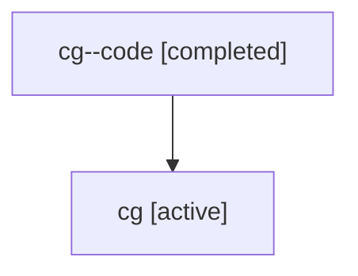

# Family: cg

Owner: `bbugyi200.athena` · Hood: `cg` · Members: 2

## Lineage

The diagram is an optional enhancement; the ordered table below contains the same lineage in accessible text.

| Role | Agent | State | Model / provider | Timing | Commits | Prompt | Chat |
|---|---|---|---|---|---:|---|---|
| code | cg--code | completed | gpt-5.6-sol / codex | 2026-07-17T19:21:09.797459+00:00 | 1 | — | [Chat](../agents/bbugyi200.athena.cg--code/chat.md) |
| root | cg | active | gpt-5.6-sol / codex | 2026-07-17T19:09:03.668926+00:00 | 1 | [Prompt](../agents/bbugyi200.athena.cg/prompt.md) | [Chat](../agents/bbugyi200.athena.cg/chat.md) |
