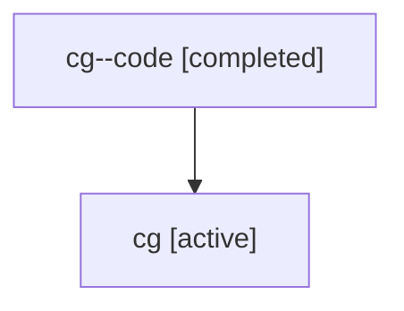

# Family: cg

[Agent Hoods](../README.md) / [bbugyi200](../users/bbugyi200/README.md) / [athena](../users/bbugyi200/machines/athena/README.md) / [cg](../users/bbugyi200/machines/athena/hoods/cg/README.md) / cg

Owner: `bbugyi200.athena` · Hood: `cg` · Members: 2

## Lineage

The diagram is an optional enhancement; the ordered table below contains the same lineage in accessible text.

| Role | Agent | State | Model / provider | Timing | Commits | Prompt | Chat |
|---|---|---|---|---|---:|---|---|
| code | cg--code | completed | gpt-5.6-sol / codex | 2026-07-17T19:21:09.797459+00:00 | [1](../agents/bbugyi200.athena.cg--code/README.md#commits) | — | [Chat](../agents/bbugyi200.athena.cg--code/chat.md) |
| root | cg | active | gpt-5.6-sol / codex | 2026-07-17T19:09:03.668926+00:00 | [1](../agents/bbugyi200.athena.cg/README.md#commits) | [Prompt](../agents/bbugyi200.athena.cg/prompt.md) | [Chat](../agents/bbugyi200.athena.cg/chat.md) |

## Commits

| Role | Commit | Subject | Committed (UTC) |
|---|---|---|---|
| code | [`f678228`](https://github.com/sase-org/sase/commit/f6782286e42727c2cdda919f27e6a3c2dbc813d5) | fix(sdd): make sidecar integration transactional | 2026-07-17 19:59:57 |
| root | [`f678228`](https://github.com/sase-org/sase/commit/f6782286e42727c2cdda919f27e6a3c2dbc813d5) | fix(sdd): make sidecar integration transactional | 2026-07-17 19:59:57 |
