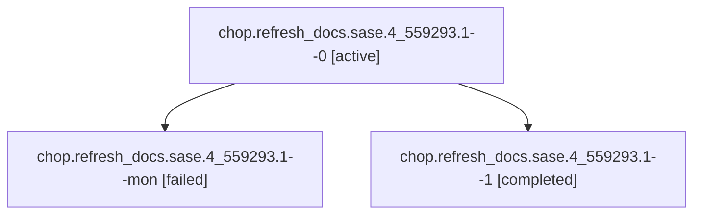

# Family: chop.refresh\_docs.sase.4\_559293.1

[Agent Hoods](../README.md) / [bbugyi200](../users/bbugyi200/README.md) / [athena](../users/bbugyi200/machines/athena/README.md) / [chop](../users/bbugyi200/machines/athena/hoods/chop/README.md) / chop.refresh\_docs.sase.4\_559293.1

Owner: `bbugyi200.athena` · Hood: `chop` · Members: 3

## Lineage

The diagram is an optional enhancement; the ordered table below contains the same lineage in accessible text.

| Role | Agent | State | Model / provider | Timing | Commits | Prompt | Chat |
|---|---|---|---|---|---:|---|---|
| 0 | chop.refresh\_docs.sase.4\_559293.1--0 | active | gpt-5.6-sol / codex | 2026-09-19T18:37:36.101279+00:00 | 0 | [Prompt](../agents/bbugyi200.athena.chop.refresh_docs.sase.4_559293.1--0/prompt.md) | [Chat](../agents/bbugyi200.athena.chop.refresh_docs.sase.4_559293.1--0/chat.md) |
| mon | chop.refresh\_docs.sase.4\_559293.1--mon | failed | gpt-5.6-sol / codex | 2026-09-19T18:54:52.246074+00:00 → 2026-09-19T19:01:52.461095+00:00 | 0 | — | [Chat](../agents/bbugyi200.athena.chop.refresh_docs.sase.4_559293.1--mon/chat.md) |
| 1 | chop.refresh\_docs.sase.4\_559293.1--1 | completed | gpt-5.6-sol / codex | 2026-09-19T19:01:52.136046+00:00 → 2026-09-19T19:06:47.369618+00:00 | [1](../agents/bbugyi200.athena.chop.refresh_docs.sase.4_559293.1--1/README.md#commits) | [Prompt](../agents/bbugyi200.athena.chop.refresh_docs.sase.4_559293.1--1/prompt.md) | [Chat](../agents/bbugyi200.athena.chop.refresh_docs.sase.4_559293.1--1/chat.md) |

## Commits

| Role | Repo | Commit | Subject | Committed |
|---|---|---|---|---|
| 1 | sase | [`ea6fc59`](https://github.com/sase-org/sase/commit/ea6fc5918dd65405b3a9e200b68857a4864b9839) | docs: refresh guides for current SASE behavior | 2026-09-19 15:04:26 EDT |

## Neighbors

| Agent | Relation | State |
|---|---|---|
| [chop.refresh\_docs.sase.4\_559293.2](../agents/bbugyi200.athena.chop.refresh_docs.sase.4_559293.2/README.md) | chop.refresh\_docs.sase.4\_559293 hood | active |
| [chop.refresh\_docs.sase.0\_190948.1](../agents/bbugyi200.athena.chop.refresh_docs.sase.0_190948.1/README.md) | chop.refresh\_docs.sase hood | dismissed |
| [chop.refresh\_docs.sase.0\_190948.2](../agents/bbugyi200.athena.chop.refresh_docs.sase.0_190948.2/README.md) | chop.refresh\_docs.sase hood | dismissed |
| [chop.refresh\_docs.sase.0\_289632.1](../agents/bbugyi200.athena.chop.refresh_docs.sase.0_289632.1/README.md) | chop.refresh\_docs.sase hood | active |
| [chop.refresh\_docs.sase.0\_289632.2](../agents/bbugyi200.athena.chop.refresh_docs.sase.0_289632.2/README.md) | chop.refresh\_docs.sase hood | active |
| [chop.refresh\_docs.sase.0\_303436.1](../agents/bbugyi200.athena.chop.refresh_docs.sase.0_303436.1/README.md) | chop.refresh\_docs.sase hood | waiting |
| [chop.refresh\_docs.sase.0\_303436.2](../agents/bbugyi200.athena.chop.refresh_docs.sase.0_303436.2/README.md) | chop.refresh\_docs.sase hood | waiting |
| [chop.refresh\_docs.sase.0\_456044.1](../agents/bbugyi200.athena.chop.refresh_docs.sase.0_456044.1/README.md) | chop.refresh\_docs.sase hood | active |
| [chop.refresh\_docs.sase.0\_456044.2](../agents/bbugyi200.athena.chop.refresh_docs.sase.0_456044.2/README.md) | chop.refresh\_docs.sase hood | active |
| [chop.refresh\_docs.sase.0\_632854.1](../agents/bbugyi200.athena.chop.refresh_docs.sase.0_632854.1/README.md) | chop.refresh\_docs.sase hood | active |
| [chop.refresh\_docs.sase.0\_632854.2](../agents/bbugyi200.athena.chop.refresh_docs.sase.0_632854.2/README.md) | chop.refresh\_docs.sase hood | waiting |
| [chop.refresh\_docs.sase.0\_740675.1](../agents/bbugyi200.athena.chop.refresh_docs.sase.0_740675.1/README.md) | chop.refresh\_docs.sase hood | active |
| [chop.refresh\_docs.sase.0\_740675.2](../agents/bbugyi200.athena.chop.refresh_docs.sase.0_740675.2/README.md) | chop.refresh\_docs.sase hood | active |
| [chop.refresh\_docs.sase.0\_753955.1](../agents/bbugyi200.athena.chop.refresh_docs.sase.0_753955.1/README.md) | chop.refresh\_docs.sase hood | active |
| [chop.refresh\_docs.sase.0\_753955.2](../agents/bbugyi200.athena.chop.refresh_docs.sase.0_753955.2/README.md) | chop.refresh\_docs.sase hood | active |
| [chop.refresh\_docs.sase.0\_772617.1](../agents/bbugyi200.athena.chop.refresh_docs.sase.0_772617.1/README.md) | chop.refresh\_docs.sase hood | active |
| [chop.refresh\_docs.sase.0\_772617.2](../agents/bbugyi200.athena.chop.refresh_docs.sase.0_772617.2/README.md) | chop.refresh\_docs.sase hood | waiting |
| [chop.refresh\_docs.sase.0\_793666.1](../agents/bbugyi200.athena.chop.refresh_docs.sase.0_793666.1/README.md) | chop.refresh\_docs.sase hood | dismissed |
| [chop.refresh\_docs.sase.0\_793666.2](../agents/bbugyi200.athena.chop.refresh_docs.sase.0_793666.2/README.md) | chop.refresh\_docs.sase hood | dismissed |
| [chop.refresh\_docs.sase.1](../agents/bbugyi200.athena.chop.refresh_docs.sase.1/README.md) | chop.refresh\_docs.sase hood | dismissed |
| [chop.refresh\_docs.sase.1\_023120.1](../agents/bbugyi200.athena.chop.refresh_docs.sase.1_023120.1/README.md) | chop.refresh\_docs.sase hood | active |
| [chop.refresh\_docs.sase.1\_023120.2](../agents/bbugyi200.athena.chop.refresh_docs.sase.1_023120.2/README.md) | chop.refresh\_docs.sase hood | active |
| [chop.refresh\_docs.sase.1\_036535.1](../agents/bbugyi200.athena.chop.refresh_docs.sase.1_036535.1/README.md) | chop.refresh\_docs.sase hood | dismissed |
| [chop.refresh\_docs.sase.1\_036535.2](../agents/bbugyi200.athena.chop.refresh_docs.sase.1_036535.2/README.md) | chop.refresh\_docs.sase hood | dismissed |
| [chop.refresh\_docs.sase.1\_212090.1](../agents/bbugyi200.athena.chop.refresh_docs.sase.1_212090.1/README.md) | chop.refresh\_docs.sase hood | active |
| [chop.refresh\_docs.sase.1\_212090.2](../agents/bbugyi200.athena.chop.refresh_docs.sase.1_212090.2/README.md) | chop.refresh\_docs.sase hood | active |
| [chop.refresh\_docs.sase.1\_232033.1](../agents/bbugyi200.athena.chop.refresh_docs.sase.1_232033.1/README.md) | chop.refresh\_docs.sase hood | dismissed |
| [chop.refresh\_docs.sase.1\_232033.2](../agents/bbugyi200.athena.chop.refresh_docs.sase.1_232033.2/README.md) | chop.refresh\_docs.sase hood | dismissed |
| [chop.refresh\_docs.sase.1\_363178.1](../agents/bbugyi200.athena.chop.refresh_docs.sase.1_363178.1/README.md) | chop.refresh\_docs.sase hood | active |
| [chop.refresh\_docs.sase.1\_363178.2](../agents/bbugyi200.athena.chop.refresh_docs.sase.1_363178.2/README.md) | chop.refresh\_docs.sase hood | active |
| [chop.refresh\_docs.sase.1\_365885.1](../agents/bbugyi200.athena.chop.refresh_docs.sase.1_365885.1/README.md) | chop.refresh\_docs.sase hood | active |
| [chop.refresh\_docs.sase.1\_365885.2](../agents/bbugyi200.athena.chop.refresh_docs.sase.1_365885.2/README.md) | chop.refresh\_docs.sase hood | waiting |
| [chop.refresh\_docs.sase.1\_574131.1](../agents/bbugyi200.athena.chop.refresh_docs.sase.1_574131.1/README.md) | chop.refresh\_docs.sase hood | dismissed |
| [chop.refresh\_docs.sase.1\_574131.2](../agents/bbugyi200.athena.chop.refresh_docs.sase.1_574131.2/README.md) | chop.refresh\_docs.sase hood | dismissed |
| [chop.refresh\_docs.sase.1\_618822.1](../agents/bbugyi200.athena.chop.refresh_docs.sase.1_618822.1/README.md) | chop.refresh\_docs.sase hood | waiting |
| [chop.refresh\_docs.sase.1\_618822.2](../agents/bbugyi200.athena.chop.refresh_docs.sase.1_618822.2/README.md) | chop.refresh\_docs.sase hood | waiting |
| [chop.refresh\_docs.sase.1\_648818.1](../agents/bbugyi200.athena.chop.refresh_docs.sase.1_648818.1/README.md) | chop.refresh\_docs.sase hood | active |
| [chop.refresh\_docs.sase.1\_648818.2](../agents/bbugyi200.athena.chop.refresh_docs.sase.1_648818.2/README.md) | chop.refresh\_docs.sase hood | active |
| [chop.refresh\_docs.sase.1\_824549.1](../agents/bbugyi200.athena.chop.refresh_docs.sase.1_824549.1/README.md) | chop.refresh\_docs.sase hood | active |
| [chop.refresh\_docs.sase.1\_824549.2](bbugyi200.athena.chop.refresh_docs.sase.1_824549.2.md) (family · 5) | chop.refresh\_docs.sase hood | active 1, completed 2, failed 2 |
| [chop.refresh\_docs.sase.2](../agents/bbugyi200.athena.chop.refresh_docs.sase.2/README.md) | chop.refresh\_docs.sase hood | dismissed |
| [chop.refresh\_docs.sase.2\_125531.1](../agents/bbugyi200.athena.chop.refresh_docs.sase.2_125531.1/README.md) | chop.refresh\_docs.sase hood | active |
| [chop.refresh\_docs.sase.2\_125531.2](../agents/bbugyi200.athena.chop.refresh_docs.sase.2_125531.2/README.md) | chop.refresh\_docs.sase hood | active |
| [chop.refresh\_docs.sase.2\_360288.1](../agents/bbugyi200.athena.chop.refresh_docs.sase.2_360288.1/README.md) | chop.refresh\_docs.sase hood | waiting |
| [chop.refresh\_docs.sase.2\_360288.2](../agents/bbugyi200.athena.chop.refresh_docs.sase.2_360288.2/README.md) | chop.refresh\_docs.sase hood | waiting |
| [chop.refresh\_docs.sase.2\_592250.1](../agents/bbugyi200.athena.chop.refresh_docs.sase.2_592250.1/README.md) | chop.refresh\_docs.sase hood | dismissed |
| [chop.refresh\_docs.sase.2\_592250.2](../agents/bbugyi200.athena.chop.refresh_docs.sase.2_592250.2/README.md) | chop.refresh\_docs.sase hood | dismissed |
| [chop.refresh\_docs.sase.2\_783024.1](../agents/bbugyi200.athena.chop.refresh_docs.sase.2_783024.1/README.md) | chop.refresh\_docs.sase hood | dismissed |
| [chop.refresh\_docs.sase.2\_783024.2](../agents/bbugyi200.athena.chop.refresh_docs.sase.2_783024.2/README.md) | chop.refresh\_docs.sase hood | dismissed |
| [chop.refresh\_docs.sase.2\_860680.1](../agents/bbugyi200.athena.chop.refresh_docs.sase.2_860680.1/README.md) | chop.refresh\_docs.sase hood | active |
| [chop.refresh\_docs.sase.2\_860680.2](../agents/bbugyi200.athena.chop.refresh_docs.sase.2_860680.2/README.md) | chop.refresh\_docs.sase hood | active |
| … and 94 more in the [hood roster](../users/bbugyi200/machines/athena/hoods/chop/README.md) | chop.refresh\_docs.sase hood | — |
