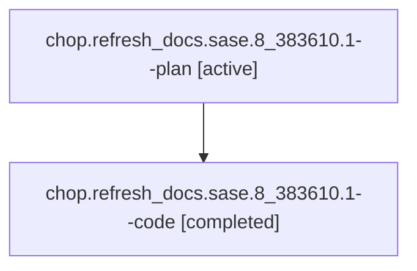

# Family: chop.refresh\_docs.sase.8\_383610.1

[Agent Hoods](../README.md) / [bbugyi200](../users/bbugyi200/README.md) / [athena](../users/bbugyi200/machines/athena/README.md) / [chop](../users/bbugyi200/machines/athena/hoods/chop/README.md) / chop.refresh\_docs.sase.8\_383610.1

Owner: `bbugyi200.athena` · Hood: `chop` · Members: 2

## Lineage

The diagram is an optional enhancement; the ordered table below contains the same lineage in accessible text.

| Role | Agent | State | Model / provider | Timing | Commits | Prompt | Chat |
|---|---|---|---|---|---:|---|---|
| plan | chop.refresh\_docs.sase.8\_383610.1--plan | active | gpt-5.6-sol / codex | 2026-08-11T10:01:51.649450+00:00 | 0 | [Prompt](../agents/bbugyi200.athena.chop.refresh_docs.sase.8_383610.1--plan/prompt.md) | [Chat](../agents/bbugyi200.athena.chop.refresh_docs.sase.8_383610.1--plan/chat.md) |
| code | chop.refresh\_docs.sase.8\_383610.1--code | completed | sonnet / claude | 2026-08-11T10:04:36.410675+00:00 | [1](../agents/bbugyi200.athena.chop.refresh_docs.sase.8_383610.1--code/README.md#commits) | — | [Chat](../agents/bbugyi200.athena.chop.refresh_docs.sase.8_383610.1--code/chat.md) |

## Commits

| Role | Repo | Commit | Subject | Committed |
|---|---|---|---|---|
| code | sase | [`b3057a6`](https://github.com/sase-org/sase/commit/b3057a618e7fed72d229230ceac7fceaf39fe0e4) | docs: refresh user-facing guides for post-64f9383f1 behavior | 2026-08-11 06:46:12 EDT |

## Neighbors

| Agent | Relation | State |
|---|---|---|
| [chop.refresh\_docs.sase.8\_383610.2](../agents/bbugyi200.athena.chop.refresh_docs.sase.8_383610.2/README.md) | chop.refresh\_docs.sase.8\_383610 hood | active |
| [chop.refresh\_docs.sase.0\_190948.1](../agents/bbugyi200.athena.chop.refresh_docs.sase.0_190948.1/README.md) | chop.refresh\_docs.sase hood | active |
| [chop.refresh\_docs.sase.0\_190948.2](../agents/bbugyi200.athena.chop.refresh_docs.sase.0_190948.2/README.md) | chop.refresh\_docs.sase hood | active |
| [chop.refresh\_docs.sase.0\_303436.1](../agents/bbugyi200.athena.chop.refresh_docs.sase.0_303436.1/README.md) | chop.refresh\_docs.sase hood | waiting |
| [chop.refresh\_docs.sase.0\_303436.2](../agents/bbugyi200.athena.chop.refresh_docs.sase.0_303436.2/README.md) | chop.refresh\_docs.sase hood | waiting |
| [chop.refresh\_docs.sase.0\_456044.1](../agents/bbugyi200.athena.chop.refresh_docs.sase.0_456044.1/README.md) | chop.refresh\_docs.sase hood | active |
| [chop.refresh\_docs.sase.0\_456044.2](../agents/bbugyi200.athena.chop.refresh_docs.sase.0_456044.2/README.md) | chop.refresh\_docs.sase hood | active |
| [chop.refresh\_docs.sase.0\_632854.1](../agents/bbugyi200.athena.chop.refresh_docs.sase.0_632854.1/README.md) | chop.refresh\_docs.sase hood | active |
| [chop.refresh\_docs.sase.0\_632854.2](../agents/bbugyi200.athena.chop.refresh_docs.sase.0_632854.2/README.md) | chop.refresh\_docs.sase hood | waiting |
| [chop.refresh\_docs.sase.0\_740675.1](../agents/bbugyi200.athena.chop.refresh_docs.sase.0_740675.1/README.md) | chop.refresh\_docs.sase hood | active |
| [chop.refresh\_docs.sase.0\_740675.2](../agents/bbugyi200.athena.chop.refresh_docs.sase.0_740675.2/README.md) | chop.refresh\_docs.sase hood | active |
| [chop.refresh\_docs.sase.0\_753955.1](../agents/bbugyi200.athena.chop.refresh_docs.sase.0_753955.1/README.md) | chop.refresh\_docs.sase hood | active |
| [chop.refresh\_docs.sase.0\_753955.2](../agents/bbugyi200.athena.chop.refresh_docs.sase.0_753955.2/README.md) | chop.refresh\_docs.sase hood | active |
| [chop.refresh\_docs.sase.0\_793666.1](../agents/bbugyi200.athena.chop.refresh_docs.sase.0_793666.1/README.md) | chop.refresh\_docs.sase hood | active |
| [chop.refresh\_docs.sase.0\_793666.2](../agents/bbugyi200.athena.chop.refresh_docs.sase.0_793666.2/README.md) | chop.refresh\_docs.sase hood | active |
| [chop.refresh\_docs.sase.1](../agents/bbugyi200.athena.chop.refresh_docs.sase.1/README.md) | chop.refresh\_docs.sase hood | dismissed |
| [chop.refresh\_docs.sase.1\_023120.1](../agents/bbugyi200.athena.chop.refresh_docs.sase.1_023120.1/README.md) | chop.refresh\_docs.sase hood | active |
| [chop.refresh\_docs.sase.1\_023120.2](../agents/bbugyi200.athena.chop.refresh_docs.sase.1_023120.2/README.md) | chop.refresh\_docs.sase hood | active |
| [chop.refresh\_docs.sase.1\_036535.1](../agents/bbugyi200.athena.chop.refresh_docs.sase.1_036535.1/README.md) | chop.refresh\_docs.sase hood | dismissed |
| [chop.refresh\_docs.sase.1\_036535.2](../agents/bbugyi200.athena.chop.refresh_docs.sase.1_036535.2/README.md) | chop.refresh\_docs.sase hood | dismissed |
| [chop.refresh\_docs.sase.1\_232033.1](../agents/bbugyi200.athena.chop.refresh_docs.sase.1_232033.1/README.md) | chop.refresh\_docs.sase hood | active |
| [chop.refresh\_docs.sase.1\_232033.2](../agents/bbugyi200.athena.chop.refresh_docs.sase.1_232033.2/README.md) | chop.refresh\_docs.sase hood | active |
| [chop.refresh\_docs.sase.1\_363178.1](../agents/bbugyi200.athena.chop.refresh_docs.sase.1_363178.1/README.md) | chop.refresh\_docs.sase hood | active |
| [chop.refresh\_docs.sase.1\_363178.2](../agents/bbugyi200.athena.chop.refresh_docs.sase.1_363178.2/README.md) | chop.refresh\_docs.sase hood | active |
| [chop.refresh\_docs.sase.1\_574131.1](../agents/bbugyi200.athena.chop.refresh_docs.sase.1_574131.1/README.md) | chop.refresh\_docs.sase hood | active |
| [chop.refresh\_docs.sase.1\_574131.2](../agents/bbugyi200.athena.chop.refresh_docs.sase.1_574131.2/README.md) | chop.refresh\_docs.sase hood | active |
| [chop.refresh\_docs.sase.1\_648818.1](../agents/bbugyi200.athena.chop.refresh_docs.sase.1_648818.1/README.md) | chop.refresh\_docs.sase hood | active |
| [chop.refresh\_docs.sase.1\_648818.2](../agents/bbugyi200.athena.chop.refresh_docs.sase.1_648818.2/README.md) | chop.refresh\_docs.sase hood | active |
| [chop.refresh\_docs.sase.1\_824549.1](../agents/bbugyi200.athena.chop.refresh_docs.sase.1_824549.1/README.md) | chop.refresh\_docs.sase hood | active |
| [chop.refresh\_docs.sase.1\_824549.2](../agents/bbugyi200.athena.chop.refresh_docs.sase.1_824549.2/README.md) | chop.refresh\_docs.sase hood | waiting |
| [chop.refresh\_docs.sase.2](../agents/bbugyi200.athena.chop.refresh_docs.sase.2/README.md) | chop.refresh\_docs.sase hood | dismissed |
| [chop.refresh\_docs.sase.2\_125531.1](../agents/bbugyi200.athena.chop.refresh_docs.sase.2_125531.1/README.md) | chop.refresh\_docs.sase hood | active |
| [chop.refresh\_docs.sase.2\_125531.2](../agents/bbugyi200.athena.chop.refresh_docs.sase.2_125531.2/README.md) | chop.refresh\_docs.sase hood | active |
| [chop.refresh\_docs.sase.2\_360288.1](../agents/bbugyi200.athena.chop.refresh_docs.sase.2_360288.1/README.md) | chop.refresh\_docs.sase hood | waiting |
| [chop.refresh\_docs.sase.2\_360288.2](../agents/bbugyi200.athena.chop.refresh_docs.sase.2_360288.2/README.md) | chop.refresh\_docs.sase hood | waiting |
| [chop.refresh\_docs.sase.2\_592250.1](../agents/bbugyi200.athena.chop.refresh_docs.sase.2_592250.1/README.md) | chop.refresh\_docs.sase hood | active |
| [chop.refresh\_docs.sase.2\_592250.2](../agents/bbugyi200.athena.chop.refresh_docs.sase.2_592250.2/README.md) | chop.refresh\_docs.sase hood | active |
| [chop.refresh\_docs.sase.2\_783024.1](../agents/bbugyi200.athena.chop.refresh_docs.sase.2_783024.1/README.md) | chop.refresh\_docs.sase hood | active |
| [chop.refresh\_docs.sase.2\_783024.2](../agents/bbugyi200.athena.chop.refresh_docs.sase.2_783024.2/README.md) | chop.refresh\_docs.sase hood | active |
| [chop.refresh\_docs.sase.2\_860680.1](../agents/bbugyi200.athena.chop.refresh_docs.sase.2_860680.1/README.md) | chop.refresh\_docs.sase hood | active |
| [chop.refresh\_docs.sase.2\_860680.2](../agents/bbugyi200.athena.chop.refresh_docs.sase.2_860680.2/README.md) | chop.refresh\_docs.sase hood | active |
| [chop.refresh\_docs.sase.2\_895086.1](../agents/bbugyi200.athena.chop.refresh_docs.sase.2_895086.1/README.md) | chop.refresh\_docs.sase hood | active |
| [chop.refresh\_docs.sase.2\_895086.2](../agents/bbugyi200.athena.chop.refresh_docs.sase.2_895086.2/README.md) | chop.refresh\_docs.sase hood | waiting |
| [chop.refresh\_docs.sase.3\_676380.1](../agents/bbugyi200.athena.chop.refresh_docs.sase.3_676380.1/README.md) | chop.refresh\_docs.sase hood | active |
| [chop.refresh\_docs.sase.3\_676380.2](../agents/bbugyi200.athena.chop.refresh_docs.sase.3_676380.2/README.md) | chop.refresh\_docs.sase hood | waiting |
| [chop.refresh\_docs.sase.3\_720355.1](../agents/bbugyi200.athena.chop.refresh_docs.sase.3_720355.1/README.md) | chop.refresh\_docs.sase hood | active |
| [chop.refresh\_docs.sase.3\_720355.2](../agents/bbugyi200.athena.chop.refresh_docs.sase.3_720355.2/README.md) | chop.refresh\_docs.sase hood | active |
| [chop.refresh\_docs.sase.3\_896860.1](../agents/bbugyi200.athena.chop.refresh_docs.sase.3_896860.1/README.md) | chop.refresh\_docs.sase hood | active |
| [chop.refresh\_docs.sase.3\_896860.2](../agents/bbugyi200.athena.chop.refresh_docs.sase.3_896860.2/README.md) | chop.refresh\_docs.sase hood | active |
| [chop.refresh\_docs.sase.3\_998258.1](../agents/bbugyi200.athena.chop.refresh_docs.sase.3_998258.1/README.md) | chop.refresh\_docs.sase hood | active |
| [chop.refresh\_docs.sase.3\_998258.2](../agents/bbugyi200.athena.chop.refresh_docs.sase.3_998258.2/README.md) | chop.refresh\_docs.sase hood | active |
| … and 64 more in the [hood roster](../users/bbugyi200/machines/athena/hoods/chop/README.md) | chop.refresh\_docs.sase hood | — |
