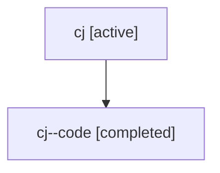

# Family: cj

[Agent Hoods](../README.md) / [bbugyi200](../users/bbugyi200/README.md) / [athena](../users/bbugyi200/machines/athena/README.md) / [cj](../users/bbugyi200/machines/athena/hoods/cj/README.md) / cj

Owner: `bbugyi200.athena` · Hood: `cj` · Members: 2

## Lineage

The diagram is an optional enhancement; the ordered table below contains the same lineage in accessible text.

| Role | Agent | State | Model / provider | Timing | Commits | Prompt | Chat |
|---|---|---|---|---|---:|---|---|
| root | cj | active | gpt-5.6-sol / codex | 2026-07-17T20:31:57.039003+00:00 | 0 | [Prompt](../agents/bbugyi200.athena.cj/prompt.md) | [Chat](../agents/bbugyi200.athena.cj/chat.md) |
| code | cj--code | completed | gpt-5.6-sol / codex | 2026-07-17T20:38:19.436141+00:00 | [1](../agents/bbugyi200.athena.cj--code/README.md#commits) | — | [Chat](../agents/bbugyi200.athena.cj--code/chat.md) |

## Commits

| Role | Repo | Commit | Subject | Committed |
|---|---|---|---|---|
| code | sase | [`c21db1e`](https://github.com/sase-org/sase/commit/c21db1e560bcd623763eb2af150ae3c8e2f96ecf) | feat(ace): add prompt-local word completion | 2026-07-17 17:06:48 EDT |
