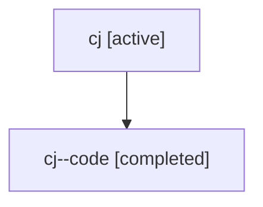

# Family: cj

Owner: `bbugyi200.athena` · Hood: `cj` · Members: 2

## Lineage

The diagram is an optional enhancement; the ordered table below contains the same lineage in accessible text.

| Role | Agent | State | Model / provider | Timing | Commits | Prompt | Chat |
|---|---|---|---|---|---:|---|---|
| root | cj | active | gpt-5.6-sol / codex | 2026-07-17T20:31:57.039003+00:00 | 1 | [Prompt](../agents/bbugyi200.athena.cj/prompt.md) | [Chat](../agents/bbugyi200.athena.cj/chat.md) |
| code | cj--code | completed | gpt-5.6-sol / codex | 2026-07-17T20:38:19.436141+00:00 | 1 | — | [Chat](../agents/bbugyi200.athena.cj--code/chat.md) |
