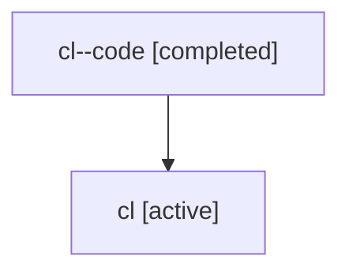

# Family: cl

[Agent Hoods](../README.md) / [bbugyi200](../users/bbugyi200/README.md) / [athena](../users/bbugyi200/machines/athena/README.md) / [cl](../users/bbugyi200/machines/athena/hoods/cl/README.md) / cl

Owner: `bbugyi200.athena` · Hood: `cl` · Members: 2

## Lineage

The diagram is an optional enhancement; the ordered table below contains the same lineage in accessible text.

| Role | Agent | State | Model / provider | Timing | Commits | Prompt | Chat |
|---|---|---|---|---|---:|---|---|
| code | cl--code | completed | gpt-5.6-sol / codex | 2026-07-17T21:43:32.469452+00:00 | [1](../agents/bbugyi200.athena.cl--code/README.md#commits) | — | [Chat](../agents/bbugyi200.athena.cl--code/chat.md) |
| root | cl | active | gpt-5.6-sol / codex | 2026-07-17T21:40:43.905049+00:00 | 0 | [Prompt](../agents/bbugyi200.athena.cl/prompt.md) | [Chat](../agents/bbugyi200.athena.cl/chat.md) |

## Commits

| Role | Repo | Commit | Subject | Committed |
|---|---|---|---|---|
| code | sase | [`f18fcfa`](https://github.com/sase-org/sase/commit/f18fcfae17f30b07c5d9dae46b3192ceff42f028) | feat(ace): compact phase bead identity header | 2026-07-17 21:57:40 UTC |
