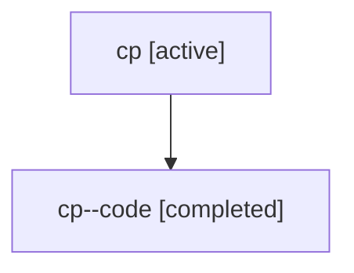

# Family: cp

[Agent Hoods](../README.md) / [bbugyi200](../users/bbugyi200/README.md) / [athena](../users/bbugyi200/machines/athena/README.md) / [cp](../users/bbugyi200/machines/athena/hoods/cp/README.md) / cp

Owner: `bbugyi200.athena` · Hood: `cp` · Members: 2

## Lineage

The diagram is an optional enhancement; the ordered table below contains the same lineage in accessible text.

| Role | Agent | State | Model / provider | Timing | Commits | Prompt | Chat |
|---|---|---|---|---|---:|---|---|
| root | cp | active | claude-fable-5 / claude | 2026-07-17T22:25:11.170123+00:00 | [1](../agents/bbugyi200.athena.cp/README.md#commits) | [Prompt](../agents/bbugyi200.athena.cp/prompt.md) | [Chat](../agents/bbugyi200.athena.cp/chat.md) |
| code | cp--code | completed | gpt-5.6-sol / codex | 2026-07-17T22:47:46.181242+00:00 | [1](../agents/bbugyi200.athena.cp--code/README.md#commits) | — | [Chat](../agents/bbugyi200.athena.cp--code/chat.md) |

## Commits

| Role | Commit | Subject | Committed (UTC) |
|---|---|---|---|
| code | [`eaf6f68`](https://github.com/sase-org/sase/commit/eaf6f6809e89010b1e31a6880d0cbaab37794195) | fix: expose family runner-slot occupancy in agent listings | 2026-07-17 23:16:18 |
| root | [`eaf6f68`](https://github.com/sase-org/sase/commit/eaf6f6809e89010b1e31a6880d0cbaab37794195) | fix: expose family runner-slot occupancy in agent listings | 2026-07-17 23:16:18 |
