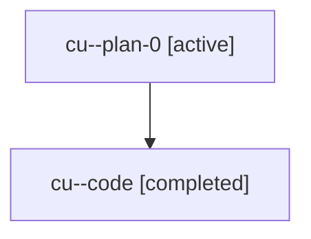

# Family: cu

[Agent Hoods](../README.md) / [bbugyi200](../users/bbugyi200/README.md) / [athena](../users/bbugyi200/machines/athena/README.md) / [cu](../users/bbugyi200/machines/athena/hoods/cu/README.md) / cu

Owner: `bbugyi200.athena` · Hood: `cu` · Members: 2

## Lineage

The diagram is an optional enhancement; the ordered table below contains the same lineage in accessible text.

| Role | Agent | State | Model / provider | Timing | Commits | Prompt | Chat |
|---|---|---|---|---|---:|---|---|
| plan-0 | cu--plan-0 | active | gpt-5.6-sol / codex | 2026-07-18T10:12:07.016837+00:00 | 0 | [Prompt](../agents/bbugyi200.athena.cu--plan-0/prompt.md) | [Chat](../agents/bbugyi200.athena.cu--plan-0/chat.md) |
| code | cu--code | completed | gpt-5.6-sol / codex | 2026-07-18T10:25:25.444225+00:00 | [1](../agents/bbugyi200.athena.cu--code/README.md#commits) | — | [Chat](../agents/bbugyi200.athena.cu--code/chat.md) |

## Commits

| Role | Repo | Commit | Subject | Committed |
|---|---|---|---|---|
| code | sase | [`c203382`](https://github.com/sase-org/sase/commit/c203382e31e0177310601b56c298bbee6a843e1c) | fix(ace): hide redundant clan tags in split panels | 2026-07-18 10:40:43 UTC |
