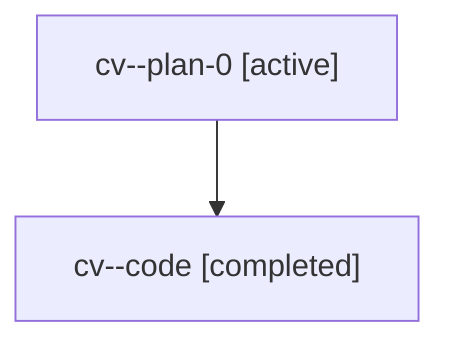

# Family: cv

[Agent Hoods](../README.md) / [bbugyi200](../users/bbugyi200/README.md) / [athena](../users/bbugyi200/machines/athena/README.md) / [cv](../users/bbugyi200/machines/athena/hoods/cv/README.md) / cv

Owner: `bbugyi200.athena` · Hood: `cv` · Members: 2

## Lineage

The diagram is an optional enhancement; the ordered table below contains the same lineage in accessible text.

| Role | Agent | State | Model / provider | Timing | Commits | Prompt | Chat |
|---|---|---|---|---|---:|---|---|
| plan-0 | cv--plan-0 | active | gpt-5.6-sol / codex | 2026-07-18T10:17:34.776077+00:00 | 0 | [Prompt](../agents/bbugyi200.athena.cv--plan-0/prompt.md) | [Chat](../agents/bbugyi200.athena.cv--plan-0/chat.md) |
| code | cv--code | completed | gpt-5.6-sol / codex | 2026-07-18T10:24:25.318963+00:00 | [1](../agents/bbugyi200.athena.cv--code/README.md#commits) | — | [Chat](../agents/bbugyi200.athena.cv--code/chat.md) |

## Commits

| Role | Commit | Subject | Committed (UTC) |
|---|---|---|---|
| code | [`cd31c08`](https://github.com/sase-org/sase/commit/cd31c083075dd2787525dc85c4872f928805a8cf) | feat(ace): clean up collapsed agent panels | 2026-07-18 10:54:49 |
