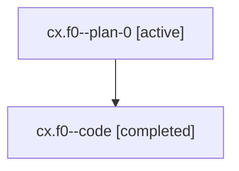

# Family: cx.f0

[Agent Hoods](../README.md) / [bbugyi200](../users/bbugyi200/README.md) / [athena](../users/bbugyi200/machines/athena/README.md) / [cx](../users/bbugyi200/machines/athena/hoods/cx/README.md) / cx.f0

Owner: `bbugyi200.athena` · Hood: `cx` · Members: 2

## Lineage

The diagram is an optional enhancement; the ordered table below contains the same lineage in accessible text.

| Role | Agent | State | Model / provider | Timing | Commits | Prompt | Chat |
|---|---|---|---|---|---:|---|---|
| plan-0 | cx.f0--plan-0 | active | gpt-5.6-sol / codex | 2026-07-18T11:47:45.440920+00:00 | 0 | [Prompt](../agents/bbugyi200.athena.cx.f0--plan-0/prompt.md) | [Chat](../agents/bbugyi200.athena.cx.f0--plan-0/chat.md) |
| code | cx.f0--code | completed | gpt-5.6-sol / codex | 2026-07-18T11:55:31.642722+00:00 | [1](../agents/bbugyi200.athena.cx.f0--code/README.md#commits) | — | [Chat](../agents/bbugyi200.athena.cx.f0--code/chat.md) |

## Commits

| Role | Repo | Commit | Subject | Committed (UTC) |
|---|---|---|---|---|
| code | sase | [`d849d62`](https://github.com/sase-org/sase/commit/d849d628bf0ac28c000e489fcd6e5074c860fbc0) | fix(ace): keep agent subtrees in outer grouping | 2026-07-18 12:19:44 |

## Neighbors

| Agent | Relation | State |
|---|---|---|
| [cx](../agents/bbugyi200.athena.cx/README.md) | ancestor | completed |
| [cx.w0.w0](../agents/bbugyi200.athena.cx.w0.w0/README.md) | cx hood | active |
| [cx.w0.w1.w0](../agents/bbugyi200.athena.cx.w0.w1.w0/README.md) | cx hood | active |
| [cx.w0.w2](../agents/bbugyi200.athena.cx.w0.w2/README.md) | cx hood | active |
| [cx.w1](bbugyi200.athena.cx.w1.md) (family · 2) | cx hood | active 2 |
