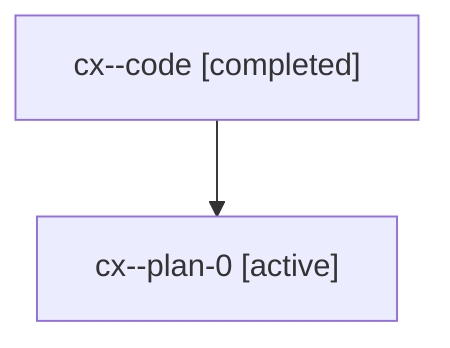

# Family: cx

[Agent Hoods](../README.md) / [bbugyi200](../users/bbugyi200/README.md) / [athena](../users/bbugyi200/machines/athena/README.md) / [cx](../users/bbugyi200/machines/athena/hoods/cx/README.md) / cx

Owner: `bbugyi200.athena` · Hood: `cx` · Members: 2

## Lineage

The diagram is an optional enhancement; the ordered table below contains the same lineage in accessible text.

| Role | Agent | State | Model / provider | Timing | Commits | Prompt | Chat |
|---|---|---|---|---|---:|---|---|
| code | cx--code | completed | gpt-5.6-sol / codex | 2026-07-18T10:31:56.335761+00:00 | 0 | — | [Chat](../agents/bbugyi200.athena.cx--code/chat.md) |
| plan-0 | cx--plan-0 | active | gpt-5.6-sol / codex | 2026-07-18T10:26:45.831570+00:00 | 0 | [Prompt](../agents/bbugyi200.athena.cx--plan-0/prompt.md) | [Chat](../agents/bbugyi200.athena.cx--plan-0/chat.md) |

## Neighbors

| Agent | Relation | State |
|---|---|---|
| [cx.f0](bbugyi200.athena.cx.f0.md) (family · 2) | descendant | active 1, completed 1 |
| [cx.f0](../agents/bbugyi200.athena.cx.f0/README.md) | descendant | completed |
| [cx.w0.w0](../agents/bbugyi200.athena.cx.w0.w0/README.md) | descendant | active |
| [cx.w0.w1.w0](../agents/bbugyi200.athena.cx.w0.w1.w0/README.md) | descendant | active |
| [cx.w0.w2](../agents/bbugyi200.athena.cx.w0.w2/README.md) | descendant | active |
| [cx.w1](bbugyi200.athena.cx.w1.md) (family · 2) | descendant | active 2 |
