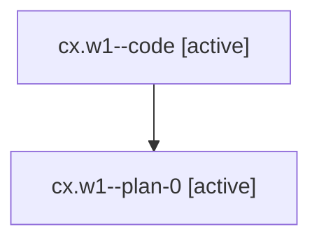

# Family: cx.w1

Owner: `bbugyi200.athena` · Hood: `cx` · Members: 2

## Lineage

The diagram is an optional enhancement; the ordered table below contains the same lineage in accessible text.

| Role | Agent | State | Model / provider | Timing | Commits | Prompt | Chat |
|---|---|---|---|---|---:|---|---|
| code | cx.w1--code | active | gpt-5.6-sol / codex | 2026-07-18T11:24:41.447907+00:00 | 0 | — | — |
| plan-0 | cx.w1--plan-0 | active | gpt-5.6-sol / codex | 2026-07-18T11:09:28.561842+00:00 | 0 | [Prompt](../agents/bbugyi200.athena.cx.w1--plan-0/prompt.md) | [Chat](../agents/bbugyi200.athena.cx.w1--plan-0/chat.md) |
